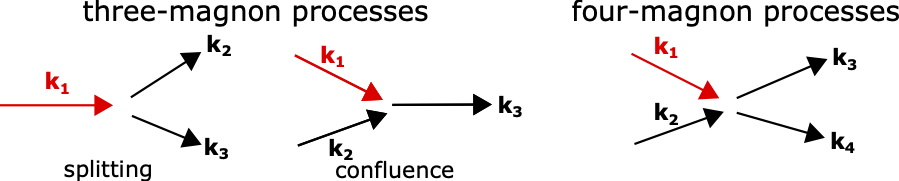
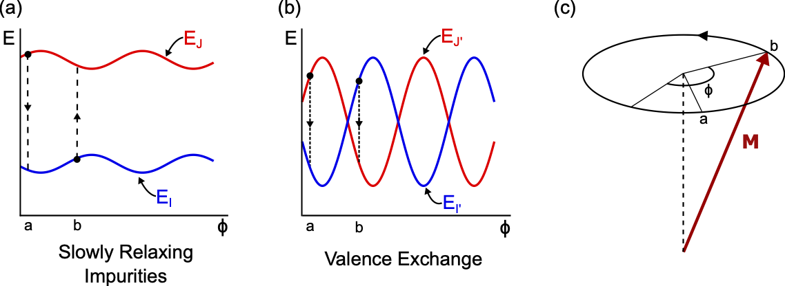
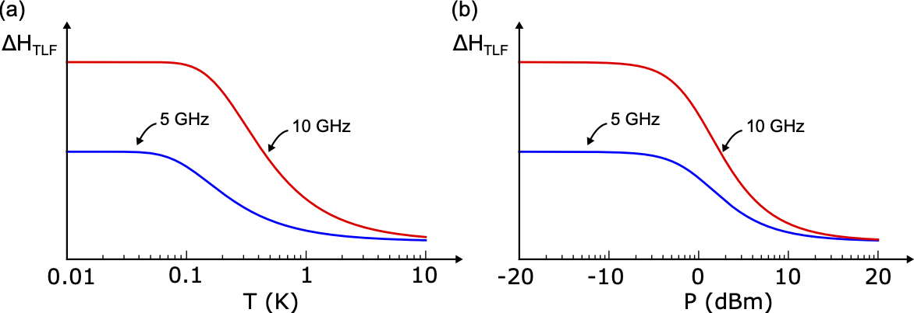



# Preface
For my PhD, I worked on the foundation of what we would like to call as the quantum magnonics in thin film architecture. In a previous work, we learned that the cryogenic magnonic damping in such a system is higher than expected. It prompted me to eventually undertake the task of understanding the potential cause of such issue at milliKelvin temperature. It certainly wasn't an easy task to design the experiments, made sense of the results, and put it in the broader context of the existing knowledge. To this day, I am very happy for how it turned out [[Kosen2019](#Kosen2019)], and the fact that it remains regularly cited after all these years goes to show that this result is useful to the community (in a paradoxical way, I hope that this trend does not continue for too long since it signifies that no significant progress has been made, and the field stays as it was before I left).

The field seems to have evolved considerably since then, and while I am sure there are new advances, unfortunately I don't keep track of much of it for quite some years. For those interested in the very latest breakthroughs, I recommend exploring recent updates via Google Scholar.

Much of the difficulty in understanding the problem at hand was navigating the large body of knowledge from the 1950s. It is a period of intense excitement when magnon-based computing was a serious competitor to the burgeoning transistor-based computing. In many ways, that era mirrors today’s competition between various platforms vying to realize a general-purpose quantum computer. Ultimately, transistors won the race, and research into magnons seemed to slow for several decades.

Coming into the field in the 21st century, I found it difficult to locate a concise summary of known damping mechanisms. The essential knowledge was scattered across disparate papers and out-of-print books that were often missing from university archives. I wrote a review chapter in my PhD thesis to synthesize the information necessary to preface my results on microwave magnon damping at milliKelvin temperatures. I believe this synthesis remains a unique contribution to the field. I am reproducing those sections here in the hope that they provide a helpful roadmap for newcomers.

The following sections are adapted from Chapter 6 and 7 of my thesis. If you find the first part, i.e., the review, useful, please consider citing the original [thesis](https://ora.ox.ac.uk/objects/uuid:5ee2230d-d015-4bc6-905d-5b4d403610d9). 

# Damping Processes in Bulk YIG

This chapter briefly discusses the known damping processes in bulk YIG from room temperature down to the millikelvin temperature regime. Readers in search of further insight are advised to consult Refs. [[Sparks1964](#Sparks1964), [Cherepanov1993](#Cherepanov1993), [Gurevich1996](#Gurevich1996), [Phillips1987](#Phillips1987)], around which much of the discussion here is based.

## Introduction
In the early years of YIG (first synthesised in 1954), much effort was focused on understanding its damping at room temperature [[Walker1965](#Walker1965)]. These studies were motivated, on the one hand, by the realisation that YIG might help further understanding of the ferromagnetic resonance phenomenon discovered a decade before [[Griffiths1946](#Griffiths1946)], and on another, by curiosity about what might ultimately be the narrowest magnon linewidth that could be achieved in this remarkable new material. 

By the 1990s, the dominant damping mechanisms in YIG up to the Curie temperature were thought to be mostly understood [[Gurevich1996](#Gurevich1996)]. The intense experimental research into the damping mechanisms of YIG and the commercial appeal of a narrow-linewidth ferrite have also led to better mastery of the techniques required to produce high-purity YIG over the last six decades. Nowadays, it is relatively easy to purchase commercially-produced bulk YIG with a MHz-linewidth at room temperature. 

With increasing interests in recent years in the study of microwave magnons at mK temperatures [[Morris2017](#Morris2017), [Zhang2015](#Zhang2015), [Tabuchi2014](#Tabuchi2014), [Tabuchi2015](#Tabuchi2015), [Kosen2018](#Kosen2018), [VanLoo2018](#VanLoo2018)], an understanding of the very low-temperature properties of YIG has emerged as a new priority. As will be discussed in this chapter and the next, damping mechanisms in YIG at mK temperatures are more complicated than at room temperature. In this chapter, we shall focus on the known damping mechanisms in **bulk** YIG from room temperature down to the mK temperature regime. The next chapter will build on this insight to develop an understanding of damping mechanism in YIG **films** below 9 K.

## Overview of damping processes

  
  

    <strong>Figure 1.</strong> Known relaxation paths for uniformly precessing microwave magnons (\(k=0\) mode) in <em>bulk YIG</em>, from millikelvin to room temperature. Diagram inspired by fig. 2.14 in Ref. <a href="#Sparks1964">[Sparks1964]</a>.
  

In the following, we shall focus on the damping of uniformly precessing magnons (\(k=0\)) excited by a low-power external microwave field. [Figure 1](#chLT_relproc) shows the known relaxation paths for uniformly precessing magnons in bulk YIG. 

Thermal magnons are those excited by thermal fluctuations within the system. Relaxation involving thermal magnons can occur through a number of mechanisms such as scattering with optical phonons or magnons (notably through the Kasuya-LeCraw processes [[Kasuya1961](#Kasuya1961)] and Kolokolov-L'vov-Cherepanov process [[Kolokolov1985](#Kolokolov1985), [Cherepanov1993](#Cherepanov1993)]), and inherent spin-spin processes [[Gurevich1996](#Gurevich1996)]. These processes become weaker as the temperature is lowered. Degenerate magnons are thermal magnons that have the same energy as the precessional mode but possess nonzero \(k\)-values. A two-magnon process can relax a \(k=0\) magnon to a degenerate magnon [[Gurevich1996](#Gurevich1996), [Sparks1964](#Sparks1964)]. Such interactions can be the dominant damping process across the whole temperature range. Magnon relaxation through ionic impurities occur through so-called temperature-peak processes [[Sparks1964](#Sparks1964), [Gurevich1996](#Gurevich1996)]. These typically dominate in the temperature range between ~1 K and ~150 K. Relaxation involving two-level fluctuators (TLFs) only dominates for temperatures below 1 K [[Phillips1987](#Phillips1987), [Tabuchi2014](#Tabuchi2014)].

After the initial relaxation event, thermal magnons can further relax through mixing with other thermal magnons (via three-magnon, four-magnon processes, etc.), through temperature-peak processes to ionic impurity excitations, or directly to the lattice [[Sparks1964](#Sparks1964)]. Ionic impurity excitations relax exclusively to the lattice [[Gurevich1996](#Gurevich1996)]. In principle, TLFs can also relax by interacting with other excitations within the system. However, as the origin of TLFs in the YIG system is unclear, it is perhaps premature to speculate about this mechanism, and therefore we add just one extra line connecting TLFs with phonons [[Phillips1987](#Phillips1987)].

Direct relaxation to the lattice is caused by the magnetoelastic interaction; in the low-\(k\) regime, this is known to be much weaker than the other processes discussed above [[Gurevich1996](#Gurevich1996)]. As such, it is seldom considered to be the dominant relaxation mechanism for \(k=0\) magnons. However, this interaction may still play an important role in relaxing high-\(k\) thermal magnons generated during subsequent relaxation events.

## Scattering with optical phonons or magnons
Damping in pure YIG is known to have a linear frequency dependence at room temperature [[Klingler2017a](#Klingler2017a)]; its magnitude decreases as the temperature is reduced from room temperature to about ~150 K [[Gurevich1975](#Gurevich1975)]. There are two competing theories used to describe this behaviour: the Kasuya-LeCraw mechanism and the Kolokolov-L'vov-Cherepanov mechanism. 

In the Kasuya-LeCraw theory, there are two processes through which the \(k=0\) magnons can relax [[Kasuya1961](#Kasuya1961), [Sparks1964](#Sparks1964)]. Both of these are caused by the modulation of the local uniaxial anisotropy by a phonon [[Cherepanov1993](#Cherepanov1993)]. The first process involves the confluence of a \(k=0\) magnon with an optical phonon to form a thermal magnon in the lowest branch of the magnon spectrum (referred to as the ferromagnon branch in Ref. [[Cherepanov1993](#Cherepanov1993)]). This mechanism reproduces the observed linear frequency and temperature dependences of the damping between ~150 K and 350 K; the predicted temperature dependence is shown to drop below linearity as the temperature is reduced below 150 K [[Sparks1964](#Sparks1964)]. The analytical derivation for the linewidth contribution from the first Kasuya-LeCraw process is described in Ref. [[Sparks1964](#Sparks1964)], it can be expressed as:
$$
\begin{align}
\Delta H_\mathrm{KL} = \left(C_\mathrm{KL} F(T)\right)\omega,
\end{align}
$$
where
$$
\begin{align}
F(T) = \frac{(\hbar\omega_{q2})^2}{k_\mathrm{B}^2T} \exp{\left( \frac{\hbar\omega_{q2}}{k_\mathrm{B}T} \right)}\left[ \exp{\left(\frac{\hbar\omega_{q2}}{k_\mathrm{B}T}\right)}-1 \right]^{-2}.
\end{align}
$$
Here, \(C_\mathrm{KL}\) is a constant related to the interaction strength and phonon properties, \(\omega_{q2}\) is the phonon frequency, and \(\omega\) is the magnon frequency. 

The second Kasuya-LeCraw process involves the confluence of a \(k=0\) magnon with a thermal magnon to form another thermal magnon in the ferromagnon branch. This mechanism predicts a damping that is linear in frequency and quadratic in temperature [[Kasuya1961](#Kasuya1961)]. The latter suggests that this process dominates at high temperatures ( T>350 K) where the observed temperature dependence is indeed above a linear behaviour [[Sparks1964](#Sparks1964)].

A little less than three decades after the Kasuya-LeCraw theory was published, a new theory by Kolokolov, L'vov, and Cherepanov [[Kolokolov1985](#Kolokolov1985)] pointed out that the quadratic dispersion relation assumed in the Kasuya-LeCraw theory is incorrect. As a result, they suggested that the linewidth contribution was overestimated by one order of magnitude. The Kolokolov-L'vov-Cherepanov theory proposed an alternative relaxation process involving the confluence of a \(k=0\) magnon with an optical magnon to produce another optical magnon; an interaction produced by the uniaxial crystallographic anisotropy of the Fe\(^{3+}\) ions in the octahedral sites. The authors claim that this mechanism can reproduce a substantial contribution to the \(k=0\) magnon linewidth at room temperature. The Kolokolov-L'vov-Cherepanov linewidth can be expressed as [[Kolokolov1985](#Kolokolov1985), [Cherepanov1993](#Cherepanov1993)]:
$$
\begin{align}
\Delta H_{KLC} \approx C_\mathrm{KLC}  \left( 13.52 (\omega)^{3/4} + 1.15(\omega)^{3/2} \right) G(T)
\end{align}
$$
where 
$$
\begin{align}
G(T) = \frac{\exp{(\Omega/T)}}{T(\exp{(\Omega/T)}-1)^2}.
\end{align}
$$
Here, \(C_\mathrm{KLC}\) is a constant related to the properties of the YIG's magnon spectrum and the interaction strength. The parameter \(\omega\) is determined by the gap in the optical magnon spectrum. [Figure 2](#fig-KL-KLC) shows the temperature- and frequency- dependence of the linewidth contributions due to the first Kasuya-LeCraw and the Kolokolov-L'vov-Cherepanov processes.

  
  

    <strong>Figure 2.</strong> Temperature- and frequency-dependent behavior of the linewidth contribution due to the first Kasuya-LeCraw (\(\hbar\omega_{q2}/k_\text{B}=100\) K <a href="#Sparks1964">[Sparks1964]</a>) and Kolokolov-L'vov-Cherepanov (\(\Omega=200\) K <a href="#Kolokolov1985">[Kolokolov1985]</a>) processes. 
    The displayed linewidths are relative to the value at \(T=300\) K for <strong>panel (a)</strong> and its value at \(f=10\) GHz for <strong>panel (b)</strong>.
  

## Two-magnon process
The term `two-magnon process' usually refers to a relaxation process where a uniformly precessing magnon (\(k=0\)) is annihilated and a degenerate magnon (\(k\ne0\)) is created [[Gurevich1996](#Gurevich1996), [Sparks1964](#Sparks1964)]. Such processes are forbidden in an ideal crystal because they do not conserve momentum. However, if there are non-uniformities within the crystal, this can provide the extra momentum contribution required to activate the process. Examples of possible non-uniformities include: disorder in the ionic distribution in the lattice [[Clogston1956](#Clogston1956)], variation in the direction of the crystal axes [Buffler1959](#Buffler1959), and geometrical non-uniformities such as pores and surface roughness [[LeCraw1958](#LeCraw1958), [Spencer1959](#Spencer1959), [Sparks1961](#Sparks1961)]. 

As a rule of thumb, two-magnon processes in high quality YIG crystals are usually dominated by the contribution from the sample's surface roughness [[Gurevich1996](#Gurevich1996), [Sparks1964](#Sparks1964)]. A number of investigations at the end of the 1950s showed that the quality of the surface polish substantially influences the \(k=0\) magnon linewidth in YIG spheres [[LeCraw1958](#LeCraw1958),[Spencer1959](#Spencer1959)]. By modelling the surface roughness as hemispherical pits on the surface [[Sparks1961](#Sparks1961), [Sparks1964](#Sparks1964), [Gurevich1996](#Gurevich1996)], the associated linewidth contribution can be expressed as 
$$
\begin{align}
\Delta H_\mathrm{2m} = C_\mathrm{2m} \frac{R_\mathrm{s}}{R_0} M_\mathrm{s}
\end{align}
$$
where \(C_\mathrm{2m}\) is a constant related to the scattering properties of the pits and the density of states available for the relaxation process, \(R_\mathrm{s}\) is the radius of the pit, \(R_0\) is the radius of the sphere, and \(M_\mathrm{s}\) is the saturation magnetisation. The expression shows that the linewidth contribution increases as the ratio of the pit size to the sample size is increased. Because the presence of a thermal magnon is not required to induce two-magnon processes (in contrast to contributions from the Kasuya-LeCraw and the Kolokolov-L'vov-Cherepanov processes), their contribution to the damping does not decrease with decreasing temperature. The only temperature dependence in the two-magnon case comes from the saturation magnetisation (\(M_\mathrm{s}\)), which increases as the temperature is decreased [[Solt1962](#Solt1962), [Maier-Flaig2017](#Maier-Flaig2017)]. 

In some cases, namely those in which the YIG has a very rough surface, two-magnon process can dominate over the Kasuya-LeCraw and the Kolokolov-L'vov-Cherepanov mechanisms in relaxing the \(k=0\) magnons. It has been reported that the linewidth of a YIG sphere can be as low as ~0.5 Oe if it is well polished and as high as ~10 Oe when polished with a 35-um grit size polishing paper [[LeCraw1958](#LeCraw1958)]. Reference [[Gurevich1996](#Gurevich1996)] claims that a really well polished YIG sphere can have a linewidth as low as ~0.3 Oe at room temperature. For comparison, an estimation by Sparks [[Sparks1964](#Sparks1964)] suggested that the first Kasuya-LeCraw process can contribute ~0.2 Oe (at 9 GHz frequency) to the \(k=0\) magnon linewidth in YIG at room temperature. It should also be understood that two-magnon processes contribute not only to initial scattering events but to subsequent relaxation events.

## Inherent spin-spin processes
Spin-spin damping has its origin in the magnetic dipolar and exchange interactions [[Gurevich1996](#Gurevich1996), [Sparks1964](#Sparks1964), [Akhiezer1968](#Akhiezer1968)]. Such processes lead to the redistribution of energy between magnon modes even in ideal systems without non-uniformities.

  
  

    <strong>Figure 3.</strong> Illustration of the three-magnon and four-magnon processes.
  

Spin-spin processes are generally classified into three-magnon and four-magnon processes, both of which are illustrated in [fig. 3](#fig-3m4m). In three-magnon processes, the number of interacting magnons is not conserved. These can only be caused by the magnetic dipolar interaction [[Gurevich1996](#Gurevich1996)]. Four-magnon process, on the other hand, can be brought about by both the dipolar and exchange interactions. Usually, the probability of a relaxation process occurring is smaller, the larger the number of participating magnons. However, as a four-magnon process can be caused by both magnetic interactions, they can dominate over their three-magnon counterparts, especially at high temperature and when participating magnons have high-\(k\) values [[Gurevich1996](#Gurevich1996)].

Three-magnon processes can be splitting or confluent in nature as illustrated in [fig. 3](#fig-3m4m). Both mechanisms require momentum and energy to be conserved; as a result, a three-magnon confluence process cannot relax magnons with low-\(k\) values (in particular \(k=0\)) [[Sparks1964](#Sparks1964)] while three-magnon splitting process can contribute to the relaxation of low-\(k\) magnons (including the \(k=0\)) so long as the applied field is low enough [[Gurevich1996](#Gurevich1996)]. Both splitting and confluence processes are active in relaxing magnons with large-\(k\) values (with no special requirement for applied field). Four-magnon processes originating from the exchange interaction can only contribute to the relaxation of \(k\ne 0\) magnons. In contrast, those brought about by the dipolar interaction can cause relaxation of \(k=0\) magnons but their contribution is less significant than the other processes mentioned above [[Akhiezer1968](#Akhiezer1968)]. 

Compared to relaxations through scattering with optical phonons or magnons, or through a two-magnon process, spin-spin processes play a less important role in relaxing \(k=0\) magnons. They are more dominant in subsequent relaxation events where magnons with higher \(k\)-values are involved [[Gurevich1996](#Gurevich1996)].
    
## Temperature-peak processes
The temperature dependence of the magnon linewidth of commercially-available YIG between 1 K and 150 K usually features one or more local maxima [[Dillon1959](#Dillon1959), [Spencer1959](#Spencer1959), [Dillon1962](#Dillon1962), [Teale1962](#Teale1962), [Seiden1964](#Seiden1964), [Jermain2017](#Jermain2017), [Maier-Flaig2017](#Maier-Flaig2017), [Mihalceanu2018](#Mihalceanu2018)]. Such behaviour cannot be accounted for by Kasuya-LeCraw or Kolokolov-L'vov-Cherepanov theories, spin-spin processes, or two-magnon process.

Through a number of experimental investigations, it has been shown that this peaking behaviour is caused by the presence of rare-earth ionic impurities introduced during crystal growth [[Geller1960](#Geller1960), [Geller1962](#Geller1962), [Sparks1964](#Sparks1964), [Gurevich1996](#Gurevich1996)]. A small impurity density can give rise to a large temperature-dependent linewidth. Three models have been put forward to explain this so-called *temperature-peak* behaviour: slowly relaxing impurities, the valence-exchange mechanism, and rapidly-relaxing impurities.

It should be noted that it is possible to decrease the linewidth contributions from these temperature-peak processes by further purifying the YIG as shown by Refs. [[Spencer1959](#Spencer1959),[Mihalceanu2018](#Mihalceanu2018)]. However, these additional steps are generally expensive and tedious. Since YIG-based devices are usually made for room-temperature applications, they are generally not part of the production process of most commercially available YIG. 

### The slowly-relaxing-impurity model
The central idea of the slowly-relaxing-impurity model is that the energy levels of each substitutional ionic impurity are modulated by the precessional motion of the magnetisation (or the Fe\(^{3+}\) ions). Under the right conditions, this leads to net energy transfer from magnons to the lattice as the impurities attempt to reach thermal equilibrium.

  
  

    <strong>Figure 4.</strong> Energy variation of the two lowest ground states, I and J, of Yb\(^{3+}\) ions in the slowly-relaxing-impurity model <strong>(panel (a))</strong> and of the extra electron in both sites I' and J' for the valence-exchange model <strong>(panel (b))</strong> as the magnetization \(M\) precesses around its equilibrium position <strong>(panel (c))</strong>. Adapted from Figs. 6.3 and 6.6 in Ref. <a href="#Sparks1964">[Sparks1964]</a>.
  

To illustrate the process, consider the case in which some of the Y\(^{3+}\) ions in the YIG (which do not contribute to its magnetisation) are replaced by another rare-earth ion such as paramagnetic Yb\(^{3+}\). This effectively produces a second magnetic sublattice in the crystal structure to which the original Fe\(^{3+}\) sublattice can couple via the exchange interaction. For ease of explanation, we shall use Yb\(^{3+}\) as a running example, however the same reasoning can, of course, be applied to a host of other rare-earth impurities [[Dillon1962](#Dillon1962), [Teale1962](#Teale1962), [Clarke1965](#Clarke1965), [Gurevich1970](#Gurevich1970)]. Like many rare-earth ions, Yb\(^{3+}\) has a low-lying doublet [[Gurevich1996](#Gurevich1996)], whose degeneracy is lifted through exchange coupling to the Fe\(^{3+}\), forming two levels, denoted as I and J [[Sparks1964](#Sparks1964)]. As the strength of the exchange coupling depends on the relative orientation of the Fe\(^{3+}\) and Yb\(^{3+}\) sublattices, precession of the Fe\(^{3+}\) system creates a modulation of the energy spacing (\(\delta E\)) between the two I and J states of the Yb\(^{3+}\) as shown in [fig. 4(a)](#fig-tpeak). As a result, the thermal population is redistributed between the two levels. 

Around position a, \(\Delta E(\mathrm{a})=E_\mathrm{J}(\mathrm{a})-E_\mathrm{I}(\mathrm{a})\) increases with the precession angle (\(\phi\)) and this causes the thermal equilibrium population ratio between level J and level I, i.e. \(N_\mathrm{J}/N_\mathrm{I}=\exp{(-\Delta E/k_\mathrm{B}T)}\), to decrease. As a result, some of the ions in level J have to transition to level I, transferring energy to the lattice in the process. At position b, \(\Delta E(\mathrm{b})\) decreases with increasing \(\phi\), causing the thermal equilibrium population ratio \(N_\mathrm{J}/N_\mathrm{I}\) to increase. Accordingly, this leads to some ions in level I to transition to level J, absorbing energy from the lattice. The competition between the rate at which thermal equilibrium is established (\(1/\tau_\mathrm{r}\)) and the rate at which the ionic energy level is modulated (\(\omega\)) determines the net energy transferred to the lattice. When both rates are equal, i.e. \(\omega\tau_\mathrm{r}\sim1\), the energy transfer to the lattice is maximal.
        
The linewidth contribution from the slowly-relaxing-impurity model is [[Clogston1955](#Clogston1955), [HartmannBoutron1964](#HartmannBoutron1964), [Gurevich1996](#Gurevich1996)]

$$
\begin{align}
\Delta H_\mathrm{SR} = \frac{1}{M_\mathrm{s}} P_1\Omega_1 
\end{align}
$$
where:

$$
\begin{align}
P_1 & = \frac{C_\mathrm{SR}}{k_\mathrm{B}T\left(\cosh{\left(\frac{\delta E}{2k_\mathrm{B}T}\right)}\right)^2}, \\ 
\Omega_1 &= \frac{\omega\tau_\mathrm{r}}{1+(\omega\tau_\mathrm{r})^2} 
\end{align}
$$
\(C_\mathrm{SR}\) is a constant that depends on the number of ionic impurities and the change in the energy spacing (\(\delta E\)) as the magnetisation precesses around its equilibrium position, \(M_\mathrm{s}\) is the saturation magnetisation, \(\omega\) is the precessional angular frequency, and \(\tau_\mathrm{r}\) is the relaxation time of the ionic energy levels.

Different processes contribute to the relaxation of the ionic energy level to the lattice as discussed in Refs. [[Gurevich1996](#Gurevich1996), [Clarke1965](#Clarke1965), [Clarke1965a](#Clarke1965a), [Orbach1961](#Orbach1961)]. At temperatures below ~60 K, relaxation is governed by the one-particle Orbach process (the so-called direct process):

$$
\begin{align}
\tau_r = \tau_{r,0} \tanh{\frac{\delta E}{2k_\mathrm{B}T}} 
\end{align}
$$
The parameter \(\tau_{r,0}\) in [eq. (9)](#chLT_eq_a) also depends on \(\delta E\) with the exact nature of its dependence being determined by the specific process involved [[Gurevich1996](#Gurevich1996)]. At higher temperatures, relaxation is governed either by the two-quasiparticle Orbach process or the Raman process, which have different temperature dependencies [[Clarke1965](#Clarke1965), [Clarke1965a](#Clarke1965a)].

Note that \(\Omega_1\) is the only frequency-dependent term in [eq. 6](#chLT_eq_b). It is maximum when \(\omega\tau_\mathrm{r}\sim1\) (see [eq. 8](#chLT_eq_bb)), a condition that corresponds to maximum energy transfer to the lattice. At a given precessional frequency \(\omega\), \(\Omega_1\) is maximum only at a particular characteristic temperature \(T_\mathrm{ch}\) as the relaxation time (\(\tau_\mathrm{r}\)) is temperature dependent. Also, [eq. (9)](#chLT_eq_a) implies that the relaxation time increases with decreasing temperature. Accordingly, the higher the precessional frequency, the higher the characteristic temperature \(T_\mathrm{c}\) at which the local maxima of the linewidth also occurs, as shown in [fig. 5(a)](#fig-w2w).

  
  

    <strong>Figure 5.</strong> Temperature-dependent linewidth (\(\Delta H\)) contribution calculated at two different magnon frequencies (\(\omega\), \(2\omega\)). 
    <strong>(a)</strong> Slowly-relaxing-impurity model with \(\delta E=8\,\text{cm}^{-1}\), \(\omega\tau_{\text{r},0}=3.3\) <a href="#Gurevich1970">[Gurevich1970]</a>. Note that the horizontal axis is logarithmic. 
    <strong>(b)</strong> Valence-exchange model with \(\tau_{\text{h},0}=0.5\times10^{-13}\,\text{s}\), \(E_{\text{b}}=0.2\,\text{eV}\) <a href="#Hansen1972">[Hansen1972]</a>. 
    In both models, the saturation magnetization is modeled according to Ref. <a href="#Maier-Flaig2017">[Maier-Flaig2017]</a>. Notice that the characteristic temperature \(T_\text{ch}\) becomes higher as \(\omega\) increases.
  

### The valence-exchange model
The valence-exchange model, also referred to as the charge-transfer model in [[Sparks1964](#Sparks1964)] or the jumping mechanism in [[Gurevich1996](#Gurevich1996)], is caused by the presence of Fe\(^{2+}\) or Fe\(^{4+}\) impurity ions within the system [[Tchernev1967](#Tchernev1967), [Tchernev1968](#Tchernev1968), [Gurevich1996](#Gurevich1996)]. We recall that the magnetisation of a pure YIG crystal is due to Fe\(^{3+}\) ions located within its crystal structure. If a ferrous impurity is substituted, the extra electron from Fe\(^{2+}\) (or the lack of electron from Fe\(^{4+}\)) is mobile and can hop to other Fe\(^{3+}\) sites. Under the right conditions, this hopping leads to a net energy transfer from magnons to lattice. We shall use the example of the Fe\(^{2+}\) ion to demonstrate why.

Consider a case in which an extra electron, presents on account of a substitutional Fe\(^{2+}\) ion, can hop between two equivalent Fe\(^{3+}\) sites, denoted as I' and J'. The energy of the extra electron at each site depends on the relative angle between the overall magnetisation of the sample and the axis of the local ion [[Gurevich1996](#Gurevich1996)]. As the magnetisation precesses (angular frequency \(\omega\)) with respect to its equilibrium position ([fig. 4(c)](#fig-tpeak)), the energy of sites I' and J' vary as illustrated in [fig. 4(b)](#fig-tpeak). As a result, the thermal equilibrium population of ions on sites I' and J' also vary with \(\phi\). At position a in [fig. 4(c)](#fig-tpeak), an extra electron that is at site J' (with higher energy) will attempt to hop to site I' (with lower energy), transferring \(E_\mathrm{J'}\mathrm{(a)}-E_\mathrm{I'}(\mathrm{a})\) from the precessional energy to the lattice. Similarly, at position b, extra electrons at site I' will attempt to hop to site J', giving away \(E_\mathrm{I'}(\mathrm{b})-E_\mathrm{J'}(\mathrm{b})\) to the lattice. In a manner similar to the slowly-relaxing-impurity model, competition between the rate at which the thermal equilibrium is established (\(1/\tau_\mathrm{h}\)) and the rate at which the site energy varies (\(\omega\)) determines the net energy transferred to the lattice per unit time. When the two rates coincide, i.e. \(\omega \tau_\mathrm{h}\sim1\) , the energy transfer to the lattice is maximum.

The theory of the valence-exchange model was first developed by Clogston [[Clogston1955](#Clogston1955)] and further improved by Hartwick and Smit [[Hartwick1968](#Hartwick1968)]; its contribution due to the linewidth is given by [[Hartwick1968](#Hartwick1968)]:

$$
\begin{align}
\Delta H_\mathrm{VE} = \frac{1}{M_\mathrm{s}}P_2\Omega_2 
\end{align}
$$
where

$$
\begin{align}
P_2 &=  \frac{C_\mathrm{VE}}{(k_\mathrm{B}T)^3}, \\
\Omega_2 &= \frac{\omega \tau_\mathrm{h}}{1+(\omega\tau_\mathrm{h})^2} 
\end{align}
$$
Here, \(C_\mathrm{VE}\) is a constant that depends on the number of substitutional ferrous impurities and the nature of energy level modulation, \(M_\mathrm{s}\) is the saturation magnetisation, \(\omega\) is the angular frequency of precession, and \(\tau_\mathrm{h}\) is the electron hopping time. The hopping time is determined by the energy barrier associated with the hopping process, \(E_\mathrm{B}\), according to [[Hansen1972](#Hansen1972), [Sparks1964](#Sparks1964)]:

$$
\begin{align}
\tau_\mathrm{h} = \tau_{\mathrm{h},0}\exp{\left(\frac{E_\mathrm{b}}{k_\mathrm{B}T}\right)}. 
\end{align}
$$
Here, both \(\tau_{\mathrm{h},0}\) and \(E_\mathrm{B}\) depend on the environment of the hopping sites. 

[Equation 10](#chLT_eq_c) has the same form as that which describes the slowly-relaxing-impurity model (compare [eq. 6](#chLT_eq_b)) and, as in the equivalent expression, \(\Omega_2\) is the only frequency-dependent term. The magnitude of [eq. 12](#chLT_eq_cc) is maximum when \(\omega\tau_\mathrm{h}\sim1\). It can be seen from [eq. 13](#chLT_eq_d) that the hopping time increases with decreasing temperature. As a result, the higher the precessional frequency, the higher the characteristic temperature (\(T_\mathrm{ch}\)) at which the local maximum of the linewidth occurs, as shown in [fig. 5(b)](#fig-w2w).

Prior to 1964 [[Wijn1953](#Wijn1953), [Spencer1961](#Spencer1961), [Yager1955](#Yager1955), [Sparks1964](#Sparks1964)], the valence-exchange model was thought to be the origin of the low-temperature maxima measured in the linewidths of some ferrites. In particular, in YIG, Spencer et al. showed that by increasing the amount of substitutional Fe\(^{2+}\), they were able to reproduce the low-temperature linewidth maximum which seemed to be strongly suggestive of the validity of the valence-exchange model [[Spencer1961](#Spencer1961)]. However, more recently, experimental evidence has indicated that, in fact, the low-temperature maximum (at ~40 K) is caused by the slowly-relaxing-impurity mechanism mediated by Fe\(^{2+}\) ions [[Hartwick1968](#Hartwick1968), [Judy1966](#Judy1966), [Epstein1967](#Epstein1967), [Hansen1972](#Hansen1972), [Gurevich1996](#Gurevich1996)]. A higher temperature linewidth maximum (370\,K) was also observed and found to be explicable by the valence-exchange model [[Hartwick1968](#Hartwick1968), [Hansen1972](#Hansen1972)]. 

### The rapidly-relaxing-impurity model

  
  

    <strong>Figure 6.</strong> Illustration of the rapidly-relaxing-impurity model. The figure shows the two lowest ground states of the impurity ion and the corresponding energy broadening. 
    <strong>(a)</strong> The transition probability is small because the broadening is not wide enough. 
    <strong>(b)</strong> When the broadening is at the same order as the level separation (\(\omega\tau_\text{r} \sim 1\)), the impurity ion can be excited by absorbing energy from the magnons. Adapted from Ref. <a href="#Gurevich1996">[Gurevich1996]</a>.
  

Rapidly relaxing impurities contribute to the magnon linewidth through ionic energy levels that relax on short timescales (\(\tau_\mathrm{r}\)). This relaxation process leads to broadening of the ionic energy levels as shown in [fig. 6](#fig-rapid). When this broadening is comparable to the energy level separation (\(\delta E=\hbar\omega_\mathrm{AB}\)), i.e. \(\omega_\mathrm{AB}\tau_\mathrm{r}\sim 1\), it can, in principle, excite an ionic impurity while absorbing energy from a magnon even though it is not resonant with the energy level spacing (usually \(\hbar\omega \ll \delta E\)). The excited ionic impurity then relaxes by decaying to the lattice.

Detailed derivation of the rapidly-relaxing-impurity model can be found in [[Kittel1959](#Kittel1959), [DeGennes1959](#DeGennes1959), [VanVleck1964](#VanVleck1964), [Sparks1964](#Sparks1964)]. Its linewidth contribution in the high-temperature limit (\(\hbar\omega \ll k_\mathrm{B}T\)) is [[Sparks1964](#Sparks1964)]
$$
\begin{align}
\Delta H_\mathrm{RR} = C_\mathrm{RR} \left(\frac{\hbar\omega}{k_\mathrm{B}T}\right) (\hbar \omega_\mathrm{AB})^2 \frac{\tau_\mathrm{r}}{1+(\omega_\mathrm{AB}\tau_\mathrm{r})^2}
\end{align}
$$
where \(C_2\) is a constant that depends on the population of the ionic impurity population and the exchange interaction strength between the ionic impurity and the Fe\(^{3+}\). In this high-temperature limit, the linewidth scales linearly with the angular precession frequency \(\omega\). i.e. it follows the Gilbert damping model. This is not the case for the slowly-relaxing-impurity or the valence-exchange models. The term \(\frac{\tau_\mathrm{r}}{1+(\omega_\mathrm{AB}\tau_\mathrm{r})^2}\) displays a maximum at a characteristic temperature that satisfies \(\omega_\mathrm{AB}\tau_\mathrm{r}\sim1\). In contrast to the slowly-relaxing-impurity (\(\omega\tau_\mathrm{r}\sim1\)) and the valence-exchange (\(\omega\tau_\mathrm{h}\sim1\)) mechanisms, the characteristic temperature in the rapidly-relaxing-impurity model does not depend on \(\omega\). To the best of the author's knowledge, there has never been an experimental study in which the rapidly-relaxing-impurity model has been directly observed experimentally.
        
## Two-level fluctuators
At temperatures below 1 K (for excitations in the GHz-frequency regime), an additional contribution to the damping in bulk YIG is found to have characteristics that are consistent with the two-level fluctuator (TLF) model [[Tabuchi2014](#Tabuchi2014), [Pfirrmann2019](#Pfirrmann2019)]. The TLF model was first proposed to explain the anomalous thermal properties of vitreous silica at temperatures below 10 K [[Anderson1972](#Anderson1972), [Phillips1987](#Phillips1987)], but was later found to be a good model to explain the damping behaviour in superconducting resonators [[Zmuidzinas2012](#Zmuidzinas2012)]. In most of the investigations to date concerning the linewidth of YIG, damping due to TLFs was not observed as the lowest temperatures were around ~2 K and the mechanism does not become a significant contributor to the damping until the temperature is lowered below 1 K.

  
  

    <strong>Figure 7.</strong> Temperature-dependent behavior <strong>(panel (a))</strong> and power-dependent behavior <strong>(panel (b))</strong> of the linewidth contribution due to TLF. Panel (a) is calculated assuming a weak external field. Panel (b) is calculated at 20 mK and 0 dBm saturation power.
  

Conceptually, the idea underpinning the TLF model is as follows: there are impurities within the material that can be modelled as an ensemble of two-level systems (fluctuators) with a broad frequency spectrum. At high temperature (\(\hbar\omega_\mathrm{TLF}\ll k_\mathrm{B}T\)), these TLFs are saturated by thermal phonons and, therefore, the material behaves as if they were not present. This is the reason why damping due to TLFs has not been observed at high temperature. At low temperature (\(\hbar\omega_\mathrm{TLF}\gg k_\mathrm{B}T\)), there are not enough thermal phonons to saturate the TLFs. If there is no external microwave drive or the drive power is low enough (\(P\ll P_\mathrm{sat}\)), most TLFs are in their ground state and ready to absorb any resonant excitation -- in our case: magnons -- within the system. If we assume that the TLFs preferentially relax to the lattice, this mechanism produces an additional damping channel. At these low temperatures, it is possible to saturate the TLFs using a strong external microwave drive (\(P\gg P_\mathrm{sat}\)); when fully saturated, they are unable to absorb more excitations from within the system and, as a result, the TLF damping becomes negligible. 

The loss tangent arising from TLFs can be modelled as [[Martinis2005](#Martinis2005)]:

$$
\begin{align}
\delta_\mathrm{TLF} = C_\mathrm{TLF} \frac{\tanh{\left(\hbar\omega/2k_\mathrm{B}T\right)}}{\sqrt{1+\left(P/P_\mathrm{sat}\right)}},
\end{align}
$$

where \(C_\mathrm{TLF}\) is a factor that depends on the density and the dipole strength of the TLF. As the loss tangent is the inverse of the quality factor, i.e. \(1/Q=\Delta \omega/\omega \approx \delta_\mathrm{TLF}\) for \(\delta_\mathrm{TLF}\ll 1\), then the linewidth contribution from the TLF is
$$
\begin{align}
\Delta H_\mathrm{TLF} = \frac{\omega}{\gamma\mu_{\circ}} \delta_\mathrm{TLF} 
\end{align}
$$
where \(\gamma\) is the gyromagnetic ratio, and \(\mu_{\circ}\) is the vacuum permeability. The power ratio within the square root of [eq. 15](#chLT_eqTLS_1) can be expressed as \(\left(P/P_\mathrm{sat}\right)=\omega_\mathrm{TLF}^2\tau_1\tau_2\) where \(\omega_\mathrm{TLF}\) is the Rabi frequency, \(\tau_1$ and \(\tau_2\) are respectively the longitudinal and transverse relaxation time constants of the TLFs. [Figure 7](#fig-TLS) shows the behaviour of \(\Delta H_\mathrm{TLF}\) as a function of temperature (\(T\)) and power (\(P\)).

It is important to note that the TLF mechanism is just a phenomenological model. It does not propose an origin for this behaviour in the system. In other physical systems such as the vitreous silica, the TLFs are thought to consist of tunnelling states between neighbouring defect sites [[Phillips1987](#Phillips1987)]. Each state is modelled as a particle tunnelling across a double well potential minimum. The origin of TLFs in bulk YIG is still unknown.

## Summary
At this point, it is helpful to summarise the dominant relaxation processes of \(k=0\) magnons in bulk YIG from room temperature down to the mK regime. From room temperature to ~100 K [[Maier-Flaig2017](#Maier-Flaig2017)], the dominant damping process is either scattering with optical phonons (first Kasuya-LeCraw process, Section [Scattering with optical phonons or magnons](#scattering-with-optical-phonons-or-magnons)) or optical magnons (Kolokolov-L'vov-Cherepanov process, Section [Scattering with optical phonons or magnons](#scattering-with-optical-phonons-or-magnons)). In this temperature range, the magnon linewidth has a linear frequency dependence and decreases with temperature. Between 1 K and 100 K, temperature-peak processes become dominant due to the presence of rare-earth impurities (Section [Temperature-peak processes](#temperature-peak-processes)). Below 1 K, TLF-type impurities have been observed to be dominant (Section [Two-level fluctuators](#two-level-fluctuators)). Poor surface quality will lead to increased linewidths (enhanced two-magnon processes, Section [Two-magnon process](#two-magnon-process)) across all temperature range. 

The total \(k=0\) magnon linewidth in a bulk YIG (\(\Delta H_\mathrm{YIG}\)) can be written as follows:
$$
\begin{align}
\Delta H_\mathrm{YIG} = \Delta H_\mathrm{KL/KLC} + \Delta H_\mathrm{2m} + \Delta H_\mathrm{TP} + \Delta H_\mathrm{TLF}
\end{align}
$$
where the contributing terms are, from left to right, the Kasuya-LeCraw term or Kolokolov-L'vov-Cherepanov term, the two-magnon term, the temperature-peak term, and the TLF term. The relative contribution of these different processes as a function of tempearture is illustrated in [fig. 8](#fig-plotall).

  
  

    <strong>Figure 8.</strong> Contributions to magnon linewidth in a YIG sphere (\(f=10\) GHz). The Kasuya-LeCraw line is calculated with \(\hbar\omega_{q2}/k_\text{B}=100\) K and normalized to 1 MHz at 300 K. The two-magnon line is calculated assuming temperature-dependent behavior from Ref. <a href="#Maier-Flaig2017">[Maier-Flaig2017]</a> and is normalized to 0.39 MHz at 10 mK <a href="#Tabuchi2014">[Tabuchi2014]</a>. The two-level fluctuator (TLF) line is calculated with \(P=0\) and is normalized to 0.63 MHz at 10 mK <a href="#Tabuchi2014">[Tabuchi2014]</a>. The slowly-relaxing line is calculated assuming \(\delta E=20\,\text{cm}^{-1}\) and \(2\pi f \tau_{\text{r},0}=3.3\), and is normalized to 3 MHz at 10 K <a href="#Tabuchi2014">[Tabuchi2014]</a>.
  

As we shall discover in the next chapter, in the case of YIG **films**, there is an additional damping channel that becomes important at low temperature.

# References

[**Akhiezer1968**] Akhiezer, A.I., Bar'yakhtar, V.G., and Peletminskii, S.V. Spin Waves. North-Holland, Amsterdam, 1968. <a href="javascript:history.back()">← Back</a>, <a href="#top">↑ Top</a>

[**Anderson1972**] Anderson, P.W., Halperin, B.I., and Varma, C.M. "Anomalous Low-Temperature Thermal Properties of Glasses and Spin Glasses." Philosophical Magazine, vol. 25, no. 1, 1972, pp. 1–9. doi:10.1080/14786437208229210. <a href="javascript:history.back()">← Back</a>, <a href="#top">↑ Top</a>

[**Buffler1959**] Buffler, C.R. "Ferromagnetic Resonance near the Upper Limit of the Spin Wave Manifold." Journal of Applied Physics, vol. 30, no. 4, 1959, pp. S172–S175. doi:10.1063/1.2185872. <a href="javascript:history.back()">← Back</a>, <a href="#top">↑ Top</a>

[**Cherepanov1993**] Cherepanov, V., Kolokolov, I., and L'vov, V. "The Saga of YIG: Spectra, Thermodynamics, Interaction and Relaxation of Magnons in a Complex Magnet." Physics Reports, vol. 229, no. 3, 1993, pp. 81–144. doi:10.1016/0370-1573(93)90107-O. <a href="javascript:history.back()">← Back</a>, <a href="#top">↑ Top</a>

[**Clarke1965**] Clarke, B.H., Tweedale, K., and Teale, R.W. "Rare-Earth Ion Relaxation Time and G Tensor in Rare-Earth-Doped Yttrium Iron Garnet. I. Ytterbium." Physical Review, vol. 139, 1965, pp. A1933–A1943. doi:10.1103/PhysRev.139.A1933. <a href="javascript:history.back()">← Back</a>, <a href="#top">↑ Top</a>

[**Clarke1965a**] Clarke, B.H. "Rare-Earth Ion Relaxation Time and G Tensor in Rare-Earth-Doped Yttrium Iron Garnet. II. Neodymium." Physical Review, vol. 139, 1965, pp. A1944–A1948. doi:10.1103/PhysRev.139.A1944. <a href="javascript:history.back()">← Back</a>, <a href="#top">↑ Top</a>

[**Clogston1955**] Clogston, A.M. "Relaxation Phenomena in Ferrites." Bell System Technical Journal, vol. 34, no. 4, 1955, pp. 739–760. doi:10.1002/j.1538-7305.1955.tb03774.x. <a href="javascript:history.back()">← Back</a>, <a href="#top">↑ Top</a>

[**Clogston1956**] Clogston, A.M., Suhl, H., Walker, L.R., and Anderson, P.W. "Ferromagnetic Resonance Line Width in Insulating Materials." Journal of Physics and Chemistry of Solids, vol. 1, no. 3, 1956, pp. 129–136. doi:10.1016/0022-3697(56)90019-1. <a href="javascript:history.back()">← Back</a>, <a href="#top">↑ Top</a>

[**DeGennes1959**] De Gennes, P.G., Kittel, C., and Portis, A.M. "Theory of Ferromagnetic Resonance in Rare Earth Garnets. II. Line Widths." Physical Review, vol. 116, no. 2, 1959, pp. 323–330. doi:10.1103/PhysRev.116.323. <a href="javascript:history.back()">← Back</a>, <a href="#top">↑ Top</a>

[**Dillon1959**] Dillon, J.F. and Nielsen, J.W. "Effects of Rare Earth Impurities on Ferrimagnetic Resonance in Yttrium Iron Garnet." Physical Review Letters, vol. 3, no. 1, 1959, pp. 30–31. doi:10.1103/PhysRevLett.3.30. <a href="javascript:history.back()">← Back</a>, <a href="#top">↑ Top</a>

[**Dillon1962**] Dillon, J.F. "Ferrimagnetic Resonance in Rare-Earth-Doped Yttrium Iron Garnet. III. Linewidth." Physical Review, vol. 127, no. 5, 1962, pp. 1495–1501. doi:10.1103/PhysRev.127.1495. <a href="javascript:history.back()">← Back</a>, <a href="#top">↑ Top</a>

[**Epstein1967**] Epstein, D.J. and Tocci, L. "High Temperature Resonance Losses in Silicon-Doped Yttrium-Iron Garnet (YIG)." Applied Physics Letters, vol. 11, no. 2, 1967, pp. 55–58. doi:10.1063/1.1755026. <a href="javascript:history.back()">← Back</a>, <a href="#top">↑ Top</a>

[**Geller1960**] Geller, S. "Magnetic Interactions and Distribution of Ions in the Garnets." Journal of Applied Physics, vol. 31, no. 5, 1960, pp. S30–S37. doi:10.1063/1.1984593. <a href="javascript:history.back()">← Back</a>, <a href="#top">↑ Top</a>

[**Geller1962**] Geller, S., Williams, H.J., Sherwood, R.C., and Espinosa, G.P. "Substitutions of Divalent Transition Metal Ions in Yttrium Iron Garnet." Journal of Applied Physics, vol. 33, no. 3, 1962, pp. 1195–1196. doi:10.1063/1.1728655. <a href="javascript:history.back()">← Back</a>, <a href="#top">↑ Top</a>

[**Griffiths1946**] Griffiths, J.H.E. "Anomalous High-Frequency Resistance of Ferromagnetic Metals." Nature, vol. 158, no. 4019, 1946, pp. 670–671. doi:10.1038/158670a0. <a href="javascript:history.back()">← Back</a>, <a href="#top">↑ Top</a>

[**Gurevich1970**] Gurevich, A.G., Ageev, A.N., and Klinger, M.I. "Resonance in Ferrimagnets Containing Paramagnetic Ions with near Crossing Energy Levels." Journal of Applied Physics, vol. 41, no. 3, 1970, pp. 1295–1302. doi:10.1063/1.1658916. <a href="javascript:history.back()">← Back</a>, <a href="#top">↑ Top</a>

[**Gurevich1975**] Gurevich, A.G. and Anisimov, A.N. "Intrinsic Spin Wave Relaxation Processes in Yttrium Iron Garnets." Soviet Journal of Experimental and Theoretical Physics, vol. 41, no. 2, 1975, pp. 336–341. <a href="javascript:history.back()">← Back</a>, <a href="#top">↑ Top</a>

[**Gurevich1996**] Gurevich, A.G. and Melkov, G.A. Magnetization Oscillations and Waves. CRC Press, Inc, 1996. ISBN: 978-0-8493-9460-7. <a href="javascript:history.back()">← Back</a>, <a href="#top">↑ Top</a>

[H**ansen1972**] Hansen, P., Tolksdorf, W., and Schuldt, J. "Anisotropy and Magnetostriction of Germanium‐substituted Yttrium Iron Garnet." Journal of Applied Physics, vol. 43, no. 11, 1972, pp. 4740–4746. doi:10.1063/1.1660999. <a href="javascript:history.back()">← Back</a>, <a href="#top">↑ Top</a>

[**HartmannBoutron1964**] Hartmann‐Boutron, F. "Effect of Rare‐earth Impurities on the Ferrimagnetic Resonance and Nuclear Relaxation in Yttrium Iron Garnet." Journal of Applied Physics, vol. 35, no. 3, 1964, pp. 889–891. doi:10.1063/1.1713521. <a href="javascript:history.back()">← Back</a>, <a href="#top">↑ Top</a>

[**Hartwick1968**] Hartwick, T.S. and Smit, J. "Ferromagnetic Resonance in Si‐doped YIG." Journal of Applied Physics, vol. 39, no. 2, 1968, pp. 827–827. doi:10.1063/1.2163631. <a href="javascript:history.back()">← Back</a>, <a href="#top">↑ Top</a>

[**Jermain2017**] Jermain, C.L., Aradhya, S.V., Reynolds, N.D., Buhrman, R.A., Brangham, J.T., Page, M.R., Hammel, P.C., Yang, F.Y., and Ralph, D.C. "Increased Low-Temperature Damping in Yttrium Iron Garnet Thin Films." Physical Review B, vol. 95, no. 17, 2017, p. 174411. doi:10.1103/PhysRevB.95.174411. <a href="javascript:history.back()">← Back</a>, <a href="#top">↑ Top</a>

[**Judy1966**] Judy, J.H. "Anisotropic Magnetic Resonance and Relaxation in Silicon‐substituted YIG." Journal of Applied Physics, vol. 37, no. 3, 1966, pp. 1328–1330. doi:10.1063/1.1708455. <a href="javascript:history.back()">← Back</a>, <a href="#top">↑ Top</a>

[**Kasuya1961**] Kasuya, T. and LeCraw, R.C. "Relaxation Mechanisms in Ferromagnetic Resonance." Physical Review Letters, vol. 6, no. 5, 1961, pp. 223–225. doi:10.1103/PhysRevLett.6.223. <a href="javascript:history.back()">← Back</a>, <a href="#top">↑ Top</a>

[**Kittel1959**] Kittel, C. "Theory of Ferromagnetic Resonance in Rare Earth Garnets. I. g Values." Physical Review, vol. 115, no. 6, 1959, pp. 1587–1590. doi:10.1103/PhysRev.115.1587. <a href="javascript:history.back()">← Back</a>, <a href="#top">↑ Top</a>

[**Klingler2017a**] Klingler, S., Maier-Flaig, H., Dubs, C., Surzhenko, O., Gross, R., Huebl, H., Goennenwein, S.T.B., and Weiler, M. "Gilbert Damping of Magnetostatic Modes in a Yttrium Iron Garnet Sphere." Applied Physics Letters, vol. 110, no. 9, 2017, p. 092409. doi:10.1063/1.4977423. <a href="javascript:history.back()">← Back</a>, <a href="#top">↑ Top</a>

[**Kolokolov1985**] Kolokolov, I.V., L'vov, V.S., and Cherepanov, V.B. "Magnon Interaction and Relaxation in YIG, a Twenty-Sublattice Ferromagnet." Soviet Journal of Experimental and Theoretical Physics, vol. 59, no. 5, 1984, pp. 1131–1139. <a href="javascript:history.back()">← Back</a>, <a href="#top">↑ Top</a>

[**Kosen2018**] Kosen, S., Morris, R.G.E., van Loo, A.F., and Karenowska, A.D. "Measurement of a Magnonic Crystal at Millikelvin Temperatures." Applied Physics Letters, vol. 112, no. 1, 2018, p. 012402. doi:10.1063/1.5011767. <a href="javascript:history.back()">← Back</a>, <a href="#top">↑ Top</a>

[**Kosen2019**] Kosen, S., van Loo, A.F., Bozhko, D.A., Mihalceanu, L., and Karenowska, A.D. "Microwave Magnon Damping in YIG Films at Millikelvin Temperatures." Unpublished, 2019. arXiv:1903.02527. <a href="javascript:history.back()">← Back</a>, <a href="#top">↑ Top</a>

[**LeCraw1958**] LeCraw, R.C., Spencer, E.G., and Porter, C.S. "Ferromagnetic Resonance Line Width in Yttrium Iron Garnet Single Crystals." Physical Review, vol. 110, no. 6, 1958, pp. 1311–1313. doi:10.1103/PhysRev.110.1311. <a href="javascript:history.back()">← Back</a>, <a href="#top">↑ Top</a>

[**Maier-Flaig2017**] Maier-Flaig, H., Klingler, S., Dubs, C., Surzhenko, O., Gross, R., Weiler, M., Huebl, H., and Goennenwein, S.T.B. "Temperature Dependent Magnetic Damping of Yttrium Iron Garnet Spheres." Physical Review B, vol. 95, no. 21, 2017, p. 214423. doi:10.1103/PhysRevB.95.214423. <a href="javascript:history.back()">← Back</a>, <a href="#top">↑ Top</a>

[**Martinis2005**] Martinis, J.M., Cooper, K.B., McDermott, R., Steffen, M., Ansmann, M., Osborn, K.D., Cicak, K., Oh, S.S., Pappas, D.P., Simmonds, R.W., and Yu, C.C. "Decoherence in Josephson Qubits from Dielectric Loss." Physical Review Letters, vol. 95, no. 21, 2005, p. 210503. doi:10.1103/PhysRevLett.95.210503. <a href="javascript:history.back()">← Back</a>, <a href="#top">↑ Top</a>

[**Mihalceanu2018**] Mihalceanu, L., Vasyuchka, V.I., Bozhko, D.A., Langner, T., Nechiporuk, A.Y., Romanyuk, V.F., Hillebrands, B., and Serga, A.A. "Temperature-Dependent Relaxation of Dipole-Exchange Magnons in Yttrium Iron Garnet Films." Physical Review B, vol. 97, no. 21, 2018, p. 214405. doi:10.1103/PhysRevB.97.214405. <a href="javascript:history.back()">← Back</a>, <a href="#top">↑ Top</a>

[**Morris2017**] Morris, R.G.E., van Loo, A.F., Kosen, S., and Karenowska, A.D. "Strong Coupling of Magnons in a YIG Sphere to Photons in a Planar Superconducting Resonator in the Quantum Limit." Scientific Reports, vol. 7, no. 1, 2017, p. 11511. doi:10.1038/s41598-017-11835-4. <a href="javascript:history.back()">← Back</a>, <a href="#top">↑ Top</a>

[**Orbach1961**] Orbach, R. "Spin-Lattice Relaxation in Rare-Earth Salts." Proceedings of the Royal Society of London. Series A. Mathematical and Physical Sciences, vol. 264, no. 1319, 1961, pp. 458–484. doi:10.1098/rspa.1961.0211. <a href="javascript:history.back()">← Back</a>, <a href="#top">↑ Top</a>

[**Pfirrmann2019**] Pfirrmann, M., Boventer, I., Schneider, A., Wolz, T., Kläui, M., Ustinov, A.V., and Weides, M. "Magnons at Low Excitations: Observation of Incoherent Coupling to a Bath of Two-Level-Systems." Unpublished, 2019. arXiv:1903.03981. <a href="javascript:history.back()">← Back</a>, <a href="#top">↑ Top</a>

[**Phillips1987**] Phillips, W.A. "Two-Level States in Glasses." Reports on Progress in Physics, vol. 50, no. 12, 1987, pp. 1657–1708. doi:10.1088/0034-4885/50/12/003. <a href="javascript:history.back()">← Back</a>, <a href="#top">↑ Top</a>

[**Seiden1964**] Seiden, P.E. "Ferrimagnetic Resonance Relaxation in Rare‐earth Iron Garnets." Journal of Applied Physics, vol. 35, no. 3, 1964, p. 891. doi:10.1063/1.1713522. <a href="javascript:history.back()">← Back</a>, <a href="#top">↑ Top</a>

[**Solt1962**] Solt, I.H. "Temperature Dependence of YIG Magnetization." Journal of Applied Physics, vol. 33, no. 3, 1962, pp. 1189–1191. doi:10.1063/1.1728651. <a href="javascript:history.back()">← Back</a>, <a href="#top">↑ Top</a>

[**Sparks1961**] Sparks, M., Loudon, R., and Kittel, C. "Ferromagnetic Relaxation. I. Theory of the Relaxation of the Uniform Precession and the Degenerate Spectrum in Insulators at Low Temperatures." Physical Review, vol. 122, no. 3, 1961, pp. 791–803. doi:10.1103/PhysRev.122.791. <a href="javascript:history.back()">← Back</a>, <a href="#top">↑ Top</a>

[**Sparks1964**] Sparks, M. Ferromagnetic-Relaxation Theory. McGraw-Hill, 1964. <a href="javascript:history.back()">← Back</a>, <a href="#top">↑ Top</a>

[**Spencer1959**] Spencer, E.G., LeCraw, R.C., and Clogston, A.M. "Low-Temperature Line-Width Maximum in Yttrium Iron Garnet." Physical Review Letters, vol. 3, no. 1, 1959, pp. 32–33. doi:10.1103/PhysRevLett.3.32. <a href="javascript:history.back()">← Back</a>, <a href="#top">↑ Top</a>

[**Spencer1961**] Spencer, E.G., LeCraw, R.C., and Linares, R.C. "Low-Temperature Ferromagnetic Relaxation in Yttrium Iron Garnet." Physical Review, vol. 123, no. 6, 1961, pp. 1937–1938. doi:10.1103/PhysRev.123.1937. <a href="javascript:history.back()">← Back</a>, <a href="#top">↑ Top</a>

[**Tabuchi2014**] Tabuchi, Y., Ishino, S., Ishikawa, T., Yamazaki, R., Usami, K., and Nakamura, Y. "Hybridizing Ferromagnetic Magnons and Microwave Photons in the Quantum Limit." Physical Review Letters, vol. 113, no. 8, 2014, p. 083603. doi:10.1103/PhysRevLett.113.083603. <a href="javascript:history.back()">← Back</a>, <a href="#top">↑ Top</a>

[**Tabuchi2015**] Tabuchi, Y., Ishino, S., Noguchi, A., Ishikawa, T., Yamazaki, R., Usami, K., and Nakamura, Y. "Coherent Coupling between a Ferromagnetic Magnon and a Superconducting Qubit." Science, vol. 349, no. 6246, 2015, pp. 405–408. doi:10.1126/science.aaa3693. <a href="javascript:history.back()">← Back</a>, <a href="#top">↑ Top</a>

[**Tchernev1967**] Tchernev, D.I. "Effect of Low‐temperature Magnetic Anneal on the Linewidth of Garnets Containing Fe\(^{2+}\) Ions." Journal of Applied Physics, vol. 38, no. 3, 1967, pp. 1046–1047. doi:10.1063/1.1709477. <a href="javascript:history.back()">← Back</a>, <a href="#top">↑ Top</a>

[**Tchernev1968**] Tchernev, D.I. "Temperature Dependence of the Linewidth of Garnets Containing Fe\(^{4+}\) Ions." Journal of Applied Physics, vol. 39, no. 2, 1968, pp. 826–827. doi:10.1063/1.2163630. <a href="javascript:history.back()">← Back</a>, <a href="#top">↑ Top</a>

[**Teale1962**] Teale, R.W. and Tweedale, K. "Ytterbium-Ion Relaxation in Ferrimagnetic Resonance." Physics Letters, vol. 1, no. 7, 1962, pp. 298–300. doi:10.1016/0031-9163(62)91392-6. <a href="javascript:history.back()">← Back</a>, <a href="#top">↑ Top</a>

[**VanLoo2018**] Van Loo, A.F., Morris, R.G.E., and Karenowska, A.D. "Time-Resolved Measurements of Surface Spin-Wave Pulses at Millikelvin Temperatures." Physical Review Applied, vol. 10, no. 4, 2018, p. 1. doi:10.1103/PhysRevApplied.10.044070. <a href="javascript:history.back()">← Back</a>, <a href="#top">↑ Top</a>

[**VanVleck1964**] Van Vleck, J.H. "Ferrimagnetic Resonance of Rare‐earth‐doped Iron Garnets." Journal of Applied Physics, vol. 35, no. 3, 1964, pp. 882–888. doi:10.1063/1.1713520. <a href="javascript:history.back()">← Back</a>, <a href="#top">↑ Top</a>

[**Walker1965**] Walker, L.R. "Ferromagnetic-Relaxation Theory. Marshall Sparks." Science, vol. 148, no. 3667, 1965, p. 218. doi:10.1126/science.148.3667.218. <a href="javascript:history.back()">← Back</a>, <a href="#top">↑ Top</a>

[**Wijn1953**] Wijn, H.P.J. and van der Heide, H. "A Richter Type After-Effect in Ferrites Containing Ferrous and Ferric Ions." Reviews of Modern Physics, vol. 25, no. 1, 1953, pp. 98–99. doi:10.1103/RevModPhys.25.98. <a href="javascript:history.back()">← Back</a>, <a href="#top">↑ Top</a>

[**Yager1955**] Yager, W.A., Galt, J.K., and Merritt, F.R. "Ferromagnetic Resonance in Two Nickel-Iron Ferrites." Physical Review, vol. 99, no. 4, 1955, pp. 1203–1210. doi:10.1103/PhysRev.99.1203. <a href="javascript:history.back()">← Back</a>, <a href="#top">↑ Top</a>

[**Zhang2015**] Zhang, D.K., Wang, X.-M. and Li, T.-F., Luo, X.-Q., Wu, W.D., Nori, F., and You, J.Q. "Cavity Quantum Electrodynamics with Ferromagnetic Magnons in a Small Yttrium-Iron-Garnet Sphere." npj Quantum Information, vol. 1, no. 1, 2015, p. 15014. doi:10.1038/npjqi.2015.14. <a href="javascript:history.back()">← Back</a>, <a href="#top">↑ Top</a>

[**Zmuidzinas2012**] Zmuidzinas, J. "Superconducting Microresonators: Physics and Applications." Annual Review of Condensed Matter Physics, vol. 3, no. 1, 2012, pp. 169–214. doi:10.1146/annurev-conmatphys-020911-125022. <a href="javascript:history.back()">← Back</a>, <a href="#top">↑ Top</a>

