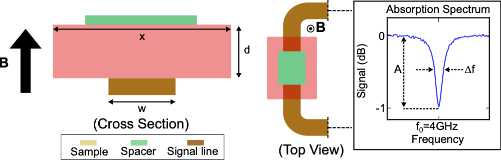
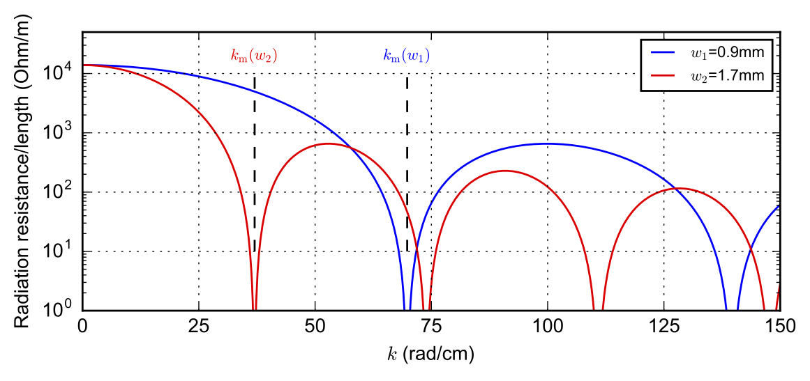
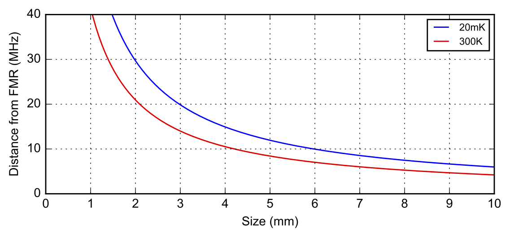
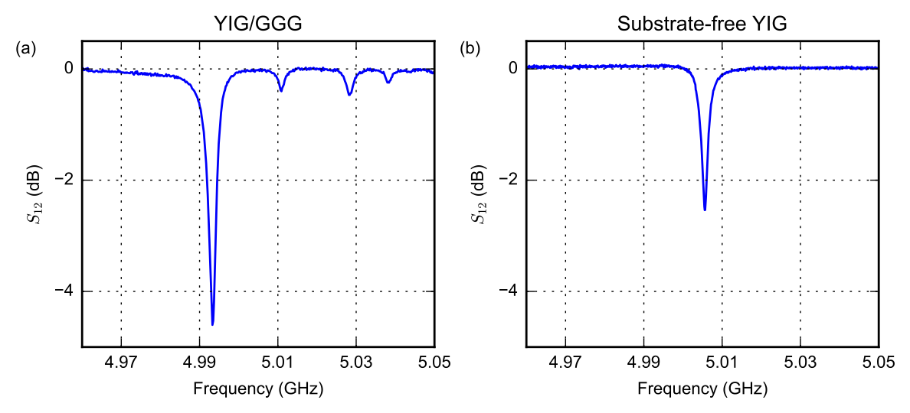
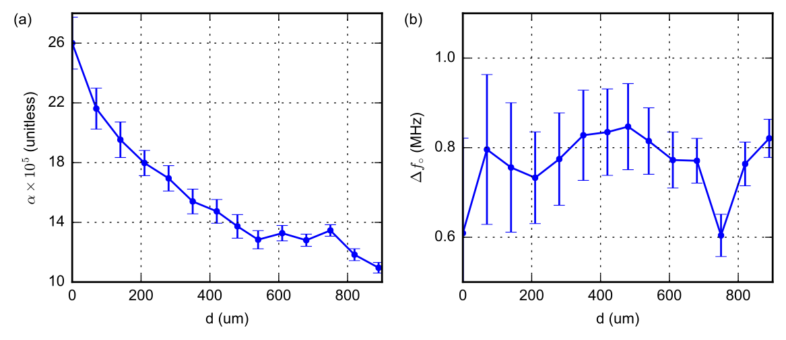
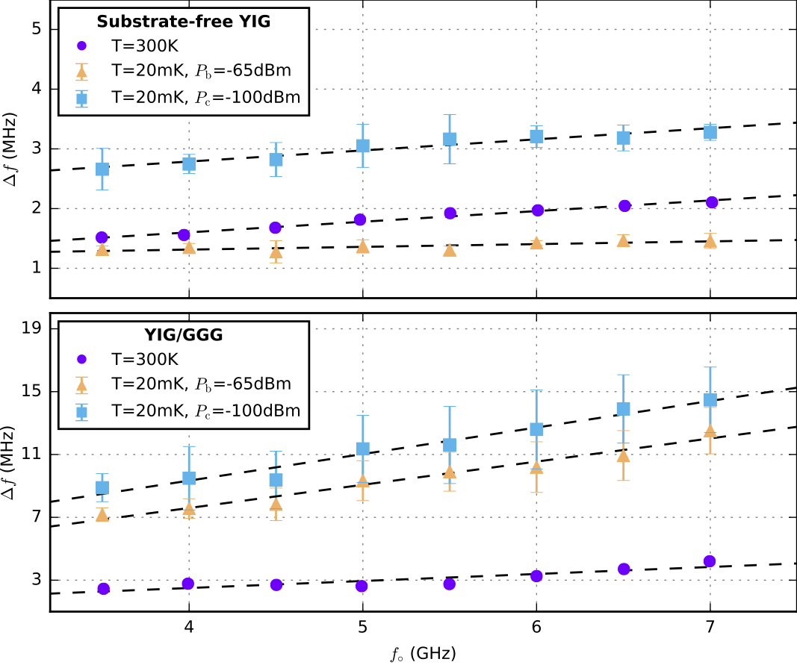
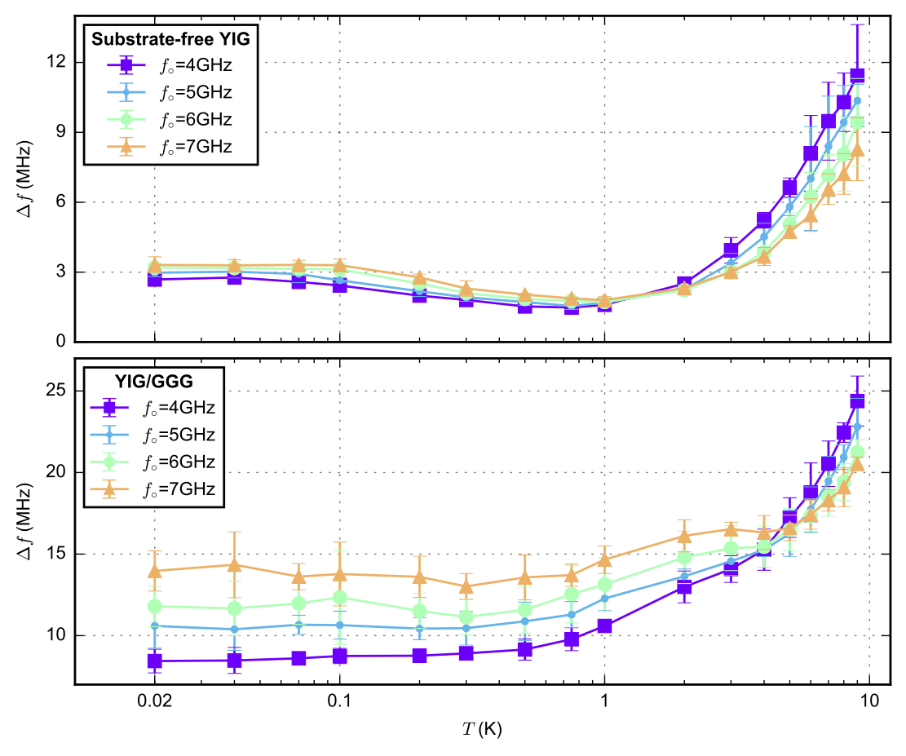
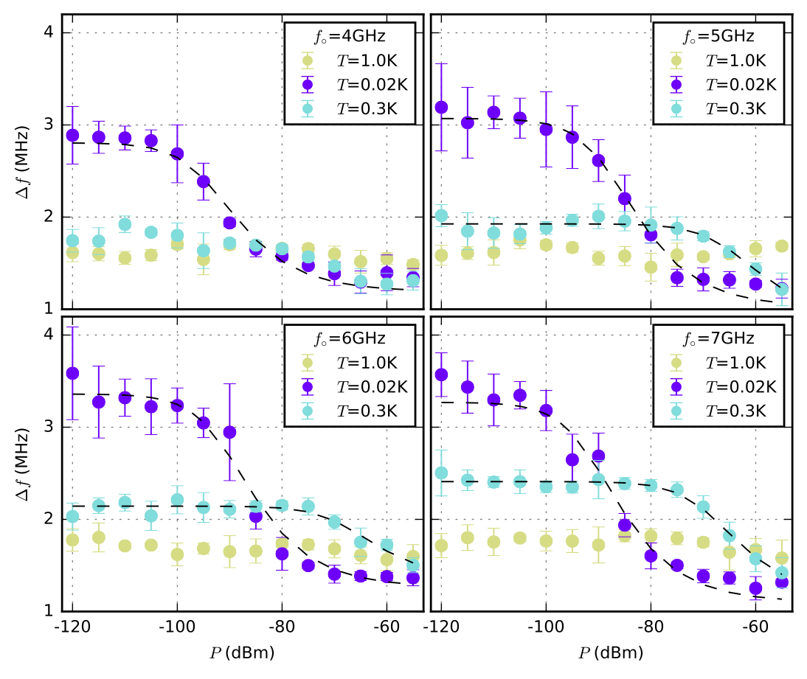
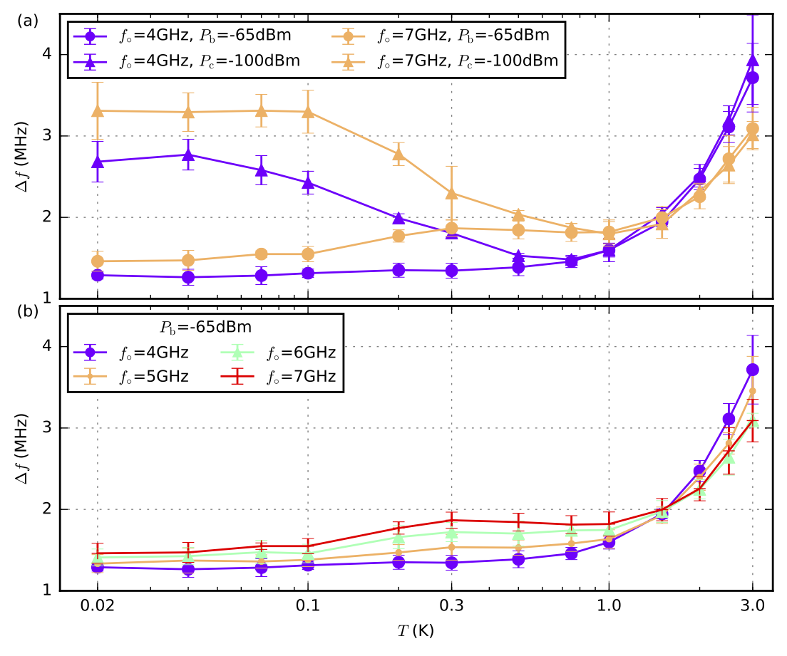
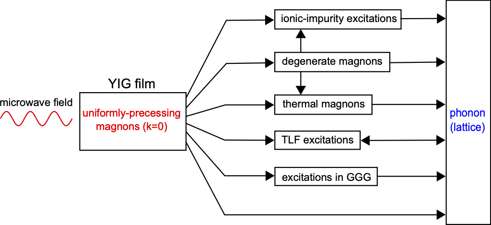



# Preface
For my PhD, I worked on the foundation of what we would like to call as the quantum magnonics in thin film architecture. In previous works, we learned that the cryogenic magnonic damping in such a system is higher than expected [[VanLoo2018](#VanLoo2018), [Mihalceanu2018](#Mihalceanu2018), [Kosen2018](#Kosen2018)]. It prompted me to eventually undertake the task of understanding the potential cause of such issue at milliKelvin temperature. It certainly wasn't an easy task to design the experiments, made sense of the results, and put it in the broader context of the existing knowledge. To this day, I am very happy for how it turned out [[Kosen2019](#Kosen2019)], and the fact that it remains regularly cited after all these years goes to show that this result is useful to the community (in a paradoxical way, I hope that this trend does not continue for too long since it signifies that no significant progress has been made, and the field stays as it was before I left).

The field seems to have evolved considerably since then, and while I am sure there are new advances, unfortunately I don't keep track of much of it for quite some years. For those interested in the very latest breakthroughs, I recommend exploring recent updates via Google Scholar.

Much of the difficulty in understanding the problem at hand was navigating the large body of knowledge from the 1950s. It is a period of intense excitement when magnon-based computing was a serious competitor to the burgeoning transistor-based computing. In many ways, that era mirrors today’s competition between various platforms vying to realize a general-purpose quantum computer. Ultimately, transistors won the race, and research into magnons seemed to slow for several decades.

Coming into the field in the 21st century, I found it difficult to locate a concise summary of known damping mechanisms. The essential knowledge was scattered across disparate papers and out-of-print books that were often missing from university archives. I wrote a review chapter in my PhD thesis to synthesize the information necessary to preface my results on microwave magnon damping at milliKelvin temperatures. I believe this synthesis remains a unique contribution to the field. I am reproducing those sections here in the hope that they provide a helpful roadmap for newcomers.

The following sections are adapted from Chapter 6 and 7 of my thesis. If you find the first part, i.e., the review, useful, please consider citing the original [[Kosen2019a](#Kosen2019a)]. 

# Damping Processes in Bulk YIG

This chapter briefly discusses the known damping processes in bulk YIG from room temperature down to the millikelvin temperature regime. Readers in search of further insight are advised to consult Refs. [[Sparks1964](#Sparks1964), [Cherepanov1993](#Cherepanov1993), [Gurevich1996](#Gurevich1996), [Phillips1987](#Phillips1987)], around which much of the discussion here is based.

## Introduction
In the early years of YIG (first synthesised in 1954), much effort was focused on understanding its damping at room temperature [[Walker1965](#Walker1965)]. These studies were motivated, on the one hand, by the realisation that YIG might help further understanding of the ferromagnetic resonance phenomenon discovered a decade before [[Griffiths1946](#Griffiths1946)], and on another, by curiosity about what might ultimately be the narrowest magnon linewidth that could be achieved in this remarkable new material. 

By the 1990s, the dominant damping mechanisms in YIG up to the Curie temperature were thought to be mostly understood [[Gurevich1996](#Gurevich1996)]. The intense experimental research into the damping mechanisms of YIG and the commercial appeal of a narrow-linewidth ferrite have also led to better mastery of the techniques required to produce high-purity YIG over the last six decades. Nowadays, it is relatively easy to purchase commercially-produced bulk YIG with a MHz-linewidth at room temperature. 

With increasing interests in recent years in the study of microwave magnons at mK temperatures [[Morris2017](#Morris2017), [Zhang2015](#Zhang2015), [Tabuchi2014](#Tabuchi2014), [Tabuchi2015](#Tabuchi2015), [Kosen2018](#Kosen2018), [VanLoo2018](#VanLoo2018)], an understanding of the very low-temperature properties of YIG has emerged as a new priority. As will be discussed in this chapter and the next, damping mechanisms in YIG at mK temperatures are more complicated than at room temperature. In this chapter, we shall focus on the known damping mechanisms in **bulk** YIG from room temperature down to the mK temperature regime. The next chapter will build on this insight to develop an understanding of damping mechanism in YIG **films** below 9 K.

## Overview of damping processes

  
  

    <strong>Figure 1.</strong> Known relaxation paths for uniformly precessing microwave magnons (\(k=0\) mode) in <em>bulk YIG</em>, from millikelvin to room temperature. Diagram inspired by fig. 2.14 in Ref. <a href="#Sparks1964">[Sparks1964]</a>.
  

In the following, we shall focus on the damping of uniformly precessing magnons (\(k=0\)) excited by a low-power external microwave field. [Figure 1](#chLT_relproc) shows the known relaxation paths for uniformly precessing magnons in bulk YIG. 

Thermal magnons are those excited by thermal fluctuations within the system. Relaxation involving thermal magnons can occur through a number of mechanisms such as scattering with optical phonons or magnons (notably through the Kasuya-LeCraw processes [[Kasuya1961](#Kasuya1961)] and Kolokolov-L'vov-Cherepanov process [[Kolokolov1985](#Kolokolov1985), [Cherepanov1993](#Cherepanov1993)]), and inherent spin-spin processes [[Gurevich1996](#Gurevich1996)]. These processes become weaker as the temperature is lowered. Degenerate magnons are thermal magnons that have the same energy as the precessional mode but possess nonzero \(k\)-values. A two-magnon process can relax a \(k=0\) magnon to a degenerate magnon [[Gurevich1996](#Gurevich1996), [Sparks1964](#Sparks1964)]. Such interactions can be the dominant damping process across the whole temperature range. Magnon relaxation through ionic impurities occur through so-called temperature-peak processes [[Sparks1964](#Sparks1964), [Gurevich1996](#Gurevich1996)]. These typically dominate in the temperature range between ~1 K and ~150 K. Relaxation involving two-level fluctuators (TLFs) only dominates for temperatures below 1 K [[Phillips1987](#Phillips1987), [Tabuchi2014](#Tabuchi2014)].

After the initial relaxation event, thermal magnons can further relax through mixing with other thermal magnons (via three-magnon, four-magnon processes, etc.), through temperature-peak processes to ionic impurity excitations, or directly to the lattice [[Sparks1964](#Sparks1964)]. Ionic impurity excitations relax exclusively to the lattice [[Gurevich1996](#Gurevich1996)]. In principle, TLFs can also relax by interacting with other excitations within the system. However, as the origin of TLFs in the YIG system is unclear, it is perhaps premature to speculate about this mechanism, and therefore we add just one extra line connecting TLFs with phonons [[Phillips1987](#Phillips1987)].

Direct relaxation to the lattice is caused by the magnetoelastic interaction; in the low-\(k\) regime, this is known to be much weaker than the other processes discussed above [[Gurevich1996](#Gurevich1996)]. As such, it is seldom considered to be the dominant relaxation mechanism for \(k=0\) magnons. However, this interaction may still play an important role in relaxing high-\(k\) thermal magnons generated during subsequent relaxation events.

## Scattering with optical phonons or magnons
Damping in pure YIG is known to have a linear frequency dependence at room temperature [[Klingler2017a](#Klingler2017a)]; its magnitude decreases as the temperature is reduced from room temperature to about ~150 K [[Gurevich1975](#Gurevich1975)]. There are two competing theories used to describe this behaviour: the Kasuya-LeCraw mechanism and the Kolokolov-L'vov-Cherepanov mechanism. 

In the Kasuya-LeCraw theory, there are two processes through which the \(k=0\) magnons can relax [[Kasuya1961](#Kasuya1961), [Sparks1964](#Sparks1964)]. Both of these are caused by the modulation of the local uniaxial anisotropy by a phonon [[Cherepanov1993](#Cherepanov1993)]. The first process involves the confluence of a \(k=0\) magnon with an optical phonon to form a thermal magnon in the lowest branch of the magnon spectrum (referred to as the ferromagnon branch in Ref. [[Cherepanov1993](#Cherepanov1993)]). This mechanism reproduces the observed linear frequency and temperature dependences of the damping between ~150 K and 350 K; the predicted temperature dependence is shown to drop below linearity as the temperature is reduced below 150 K [[Sparks1964](#Sparks1964)]. The analytical derivation for the linewidth contribution from the first Kasuya-LeCraw process is described in Ref. [[Sparks1964](#Sparks1964)], it can be expressed as:
$$
\begin{align}
\Delta H_\mathrm{KL} = \left(C_\mathrm{KL} F(T)\right)\omega,
\end{align}
$$
where
$$
\begin{align}
F(T) = \frac{(\hbar\omega_{q2})^2}{k_\mathrm{B}^2T} \exp{\left( \frac{\hbar\omega_{q2}}{k_\mathrm{B}T} \right)}\left[ \exp{\left(\frac{\hbar\omega_{q2}}{k_\mathrm{B}T}\right)}-1 \right]^{-2}.
\end{align}
$$
Here, \(C_\mathrm{KL}\) is a constant related to the interaction strength and phonon properties, \(\omega_{q2}\) is the phonon frequency, and \(\omega\) is the magnon frequency. 

The second Kasuya-LeCraw process involves the confluence of a \(k=0\) magnon with a thermal magnon to form another thermal magnon in the ferromagnon branch. This mechanism predicts a damping that is linear in frequency and quadratic in temperature [[Kasuya1961](#Kasuya1961)]. The latter suggests that this process dominates at high temperatures ( T>350 K) where the observed temperature dependence is indeed above a linear behaviour [[Sparks1964](#Sparks1964)].

A little less than three decades after the Kasuya-LeCraw theory was published, a new theory by Kolokolov, L'vov, and Cherepanov [[Kolokolov1985](#Kolokolov1985)] pointed out that the quadratic dispersion relation assumed in the Kasuya-LeCraw theory is incorrect. As a result, they suggested that the linewidth contribution was overestimated by one order of magnitude. The Kolokolov-L'vov-Cherepanov theory proposed an alternative relaxation process involving the confluence of a \(k=0\) magnon with an optical magnon to produce another optical magnon; an interaction produced by the uniaxial crystallographic anisotropy of the Fe\(^{3+}\) ions in the octahedral sites. The authors claim that this mechanism can reproduce a substantial contribution to the \(k=0\) magnon linewidth at room temperature. The Kolokolov-L'vov-Cherepanov linewidth can be expressed as [[Kolokolov1985](#Kolokolov1985), [Cherepanov1993](#Cherepanov1993)]:
$$
\begin{align}
\Delta H_{KLC} \approx C_\mathrm{KLC}  \left( 13.52 (\omega)^{3/4} + 1.15(\omega)^{3/2} \right) G(T)
\end{align}
$$
where 
$$
\begin{align}
G(T) = \frac{\exp{(\Omega/T)}}{T(\exp{(\Omega/T)}-1)^2}.
\end{align}
$$
Here, \(C_\mathrm{KLC}\) is a constant related to the properties of the YIG's magnon spectrum and the interaction strength. The parameter \(\omega\) is determined by the gap in the optical magnon spectrum. [Figure 2](#fig-KL-KLC) shows the temperature- and frequency- dependence of the linewidth contributions due to the first Kasuya-LeCraw and the Kolokolov-L'vov-Cherepanov processes.

  
  

    <strong>Figure 2.</strong> Temperature- and frequency-dependent behavior of the linewidth contribution due to the first Kasuya-LeCraw (\(\hbar\omega_{q2}/k_\text{B}=100\) K <a href="#Sparks1964">[Sparks1964]</a>) and Kolokolov-L'vov-Cherepanov (\(\Omega=200\) K <a href="#Kolokolov1985">[Kolokolov1985]</a>) processes. 
    The displayed linewidths are relative to the value at \(T=300\) K for <strong>panel (a)</strong> and its value at \(f=10\) GHz for <strong>panel (b)</strong>.
  

## Two-magnon process
The term `two-magnon process' usually refers to a relaxation process where a uniformly precessing magnon (\(k=0\)) is annihilated and a degenerate magnon (\(k\ne0\)) is created [[Gurevich1996](#Gurevich1996), [Sparks1964](#Sparks1964)]. Such processes are forbidden in an ideal crystal because they do not conserve momentum. However, if there are non-uniformities within the crystal, this can provide the extra momentum contribution required to activate the process. Examples of possible non-uniformities include: disorder in the ionic distribution in the lattice [[Clogston1956](#Clogston1956)], variation in the direction of the crystal axes [Buffler1959](#Buffler1959), and geometrical non-uniformities such as pores and surface roughness [[LeCraw1958](#LeCraw1958), [Spencer1959](#Spencer1959), [Sparks1961](#Sparks1961)]. 

As a rule of thumb, two-magnon processes in high quality YIG crystals are usually dominated by the contribution from the sample's surface roughness [[Gurevich1996](#Gurevich1996), [Sparks1964](#Sparks1964)]. A number of investigations at the end of the 1950s showed that the quality of the surface polish substantially influences the \(k=0\) magnon linewidth in YIG spheres [[LeCraw1958](#LeCraw1958),[Spencer1959](#Spencer1959)]. By modelling the surface roughness as hemispherical pits on the surface [[Sparks1961](#Sparks1961), [Sparks1964](#Sparks1964), [Gurevich1996](#Gurevich1996)], the associated linewidth contribution can be expressed as 
$$
\begin{align}
\Delta H_\mathrm{2m} = C_\mathrm{2m} \frac{R_\mathrm{s}}{R_0} M_\mathrm{s}
\end{align}
$$
where \(C_\mathrm{2m}\) is a constant related to the scattering properties of the pits and the density of states available for the relaxation process, \(R_\mathrm{s}\) is the radius of the pit, \(R_0\) is the radius of the sphere, and \(M_\mathrm{s}\) is the saturation magnetisation. The expression shows that the linewidth contribution increases as the ratio of the pit size to the sample size is increased. Because the presence of a thermal magnon is not required to induce two-magnon processes (in contrast to contributions from the Kasuya-LeCraw and the Kolokolov-L'vov-Cherepanov processes), their contribution to the damping does not decrease with decreasing temperature. The only temperature dependence in the two-magnon case comes from the saturation magnetisation (\(M_\mathrm{s}\)), which increases as the temperature is decreased [[Solt1962](#Solt1962), [Maier-Flaig2017](#Maier-Flaig2017)]. 

In some cases, namely those in which the YIG has a very rough surface, two-magnon process can dominate over the Kasuya-LeCraw and the Kolokolov-L'vov-Cherepanov mechanisms in relaxing the \(k=0\) magnons. It has been reported that the linewidth of a YIG sphere can be as low as ~0.5 Oe if it is well polished and as high as ~10 Oe when polished with a 35-um grit size polishing paper [[LeCraw1958](#LeCraw1958)]. Reference [[Gurevich1996](#Gurevich1996)] claims that a really well polished YIG sphere can have a linewidth as low as ~0.3 Oe at room temperature. For comparison, an estimation by Sparks [[Sparks1964](#Sparks1964)] suggested that the first Kasuya-LeCraw process can contribute ~0.2 Oe (at 9 GHz frequency) to the \(k=0\) magnon linewidth in YIG at room temperature. It should also be understood that two-magnon processes contribute not only to initial scattering events but to subsequent relaxation events.

## Inherent spin-spin processes
Spin-spin damping has its origin in the magnetic dipolar and exchange interactions [[Gurevich1996](#Gurevich1996), [Sparks1964](#Sparks1964), [Akhiezer1968](#Akhiezer1968)]. Such processes lead to the redistribution of energy between magnon modes even in ideal systems without non-uniformities.

  
  

    <strong>Figure 3.</strong> Illustration of the three-magnon and four-magnon processes.
  

Spin-spin processes are generally classified into three-magnon and four-magnon processes, both of which are illustrated in [fig. 3](#fig-3m4m). In three-magnon processes, the number of interacting magnons is not conserved. These can only be caused by the magnetic dipolar interaction [[Gurevich1996](#Gurevich1996)]. Four-magnon process, on the other hand, can be brought about by both the dipolar and exchange interactions. Usually, the probability of a relaxation process occurring is smaller, the larger the number of participating magnons. However, as a four-magnon process can be caused by both magnetic interactions, they can dominate over their three-magnon counterparts, especially at high temperature and when participating magnons have high-\(k\) values [[Gurevich1996](#Gurevich1996)].

Three-magnon processes can be splitting or confluent in nature as illustrated in [fig. 3](#fig-3m4m). Both mechanisms require momentum and energy to be conserved; as a result, a three-magnon confluence process cannot relax magnons with low-\(k\) values (in particular \(k=0\)) [[Sparks1964](#Sparks1964)] while three-magnon splitting process can contribute to the relaxation of low-\(k\) magnons (including the \(k=0\)) so long as the applied field is low enough [[Gurevich1996](#Gurevich1996)]. Both splitting and confluence processes are active in relaxing magnons with large-\(k\) values (with no special requirement for applied field). Four-magnon processes originating from the exchange interaction can only contribute to the relaxation of \(k\ne 0\) magnons. In contrast, those brought about by the dipolar interaction can cause relaxation of \(k=0\) magnons but their contribution is less significant than the other processes mentioned above [[Akhiezer1968](#Akhiezer1968)]. 

Compared to relaxations through scattering with optical phonons or magnons, or through a two-magnon process, spin-spin processes play a less important role in relaxing \(k=0\) magnons. They are more dominant in subsequent relaxation events where magnons with higher \(k\)-values are involved [[Gurevich1996](#Gurevich1996)].
    
## Temperature-peak processes
The temperature dependence of the magnon linewidth of commercially-available YIG between 1 K and 150 K usually features one or more local maxima [[Dillon1959](#Dillon1959), [Spencer1959](#Spencer1959), [Dillon1962](#Dillon1962), [Teale1962](#Teale1962), [Seiden1964](#Seiden1964), [Jermain2017](#Jermain2017), [Maier-Flaig2017](#Maier-Flaig2017), [Mihalceanu2018](#Mihalceanu2018)]. Such behaviour cannot be accounted for by Kasuya-LeCraw or Kolokolov-L'vov-Cherepanov theories, spin-spin processes, or two-magnon process.

Through a number of experimental investigations, it has been shown that this peaking behaviour is caused by the presence of rare-earth ionic impurities introduced during crystal growth [[Geller1960](#Geller1960), [Geller1962](#Geller1962), [Sparks1964](#Sparks1964), [Gurevich1996](#Gurevich1996)]. A small impurity density can give rise to a large temperature-dependent linewidth. Three models have been put forward to explain this so-called *temperature-peak* behaviour: slowly relaxing impurities, the valence-exchange mechanism, and rapidly-relaxing impurities.

It should be noted that it is possible to decrease the linewidth contributions from these temperature-peak processes by further purifying the YIG as shown by Refs. [[Spencer1959](#Spencer1959),[Mihalceanu2018](#Mihalceanu2018)]. However, these additional steps are generally expensive and tedious. Since YIG-based devices are usually made for room-temperature applications, they are generally not part of the production process of most commercially available YIG. 

### The slowly-relaxing-impurity model
The central idea of the slowly-relaxing-impurity model is that the energy levels of each substitutional ionic impurity are modulated by the precessional motion of the magnetisation (or the Fe\(^{3+}\) ions). Under the right conditions, this leads to net energy transfer from magnons to the lattice as the impurities attempt to reach thermal equilibrium.

  
  

    <strong>Figure 4.</strong> Energy variation of the two lowest ground states, I and J, of Yb\(^{3+}\) ions in the slowly-relaxing-impurity model <strong>(panel (a))</strong> and of the extra electron in both sites I' and J' for the valence-exchange model <strong>(panel (b))</strong> as the magnetization \(M\) precesses around its equilibrium position <strong>(panel (c))</strong>. Adapted from Figs. 6.3 and 6.6 in Ref. <a href="#Sparks1964">[Sparks1964]</a>.
  

To illustrate the process, consider the case in which some of the Y\(^{3+}\) ions in the YIG (which do not contribute to its magnetisation) are replaced by another rare-earth ion such as paramagnetic Yb\(^{3+}\). This effectively produces a second magnetic sublattice in the crystal structure to which the original Fe\(^{3+}\) sublattice can couple via the exchange interaction. For ease of explanation, we shall use Yb\(^{3+}\) as a running example, however the same reasoning can, of course, be applied to a host of other rare-earth impurities [[Dillon1962](#Dillon1962), [Teale1962](#Teale1962), [Clarke1965](#Clarke1965), [Gurevich1970](#Gurevich1970)]. Like many rare-earth ions, Yb\(^{3+}\) has a low-lying doublet [[Gurevich1996](#Gurevich1996)], whose degeneracy is lifted through exchange coupling to the Fe\(^{3+}\), forming two levels, denoted as I and J [[Sparks1964](#Sparks1964)]. As the strength of the exchange coupling depends on the relative orientation of the Fe\(^{3+}\) and Yb\(^{3+}\) sublattices, precession of the Fe\(^{3+}\) system creates a modulation of the energy spacing (\(\delta E\)) between the two I and J states of the Yb\(^{3+}\) as shown in [fig. 4(a)](#fig-tpeak). As a result, the thermal population is redistributed between the two levels. 

Around position a, \(\Delta E(\mathrm{a})=E_\mathrm{J}(\mathrm{a})-E_\mathrm{I}(\mathrm{a})\) increases with the precession angle (\(\phi\)) and this causes the thermal equilibrium population ratio between level J and level I, i.e. \(N_\mathrm{J}/N_\mathrm{I}=\exp{(-\Delta E/k_\mathrm{B}T)}\), to decrease. As a result, some of the ions in level J have to transition to level I, transferring energy to the lattice in the process. At position b, \(\Delta E(\mathrm{b})\) decreases with increasing \(\phi\), causing the thermal equilibrium population ratio \(N_\mathrm{J}/N_\mathrm{I}\) to increase. Accordingly, this leads to some ions in level I to transition to level J, absorbing energy from the lattice. The competition between the rate at which thermal equilibrium is established (\(1/\tau_\mathrm{r}\)) and the rate at which the ionic energy level is modulated (\(\omega\)) determines the net energy transferred to the lattice. When both rates are equal, i.e. \(\omega\tau_\mathrm{r}\sim1\), the energy transfer to the lattice is maximal.
        
The linewidth contribution from the slowly-relaxing-impurity model is [[Clogston1955](#Clogston1955), [HartmannBoutron1964](#HartmannBoutron1964), [Gurevich1996](#Gurevich1996)]

$$
\begin{align}
\Delta H_\mathrm{SR} = \frac{1}{M_\mathrm{s}} P_1\Omega_1 
\end{align}
$$
where:

$$
\begin{align}
P_1 & = \frac{C_\mathrm{SR}}{k_\mathrm{B}T\left(\cosh{\left(\frac{\delta E}{2k_\mathrm{B}T}\right)}\right)^2}, \\ 
\Omega_1 &= \frac{\omega\tau_\mathrm{r}}{1+(\omega\tau_\mathrm{r})^2} 
\end{align}
$$
\(C_\mathrm{SR}\) is a constant that depends on the number of ionic impurities and the change in the energy spacing (\(\delta E\)) as the magnetisation precesses around its equilibrium position, \(M_\mathrm{s}\) is the saturation magnetisation, \(\omega\) is the precessional angular frequency, and \(\tau_\mathrm{r}\) is the relaxation time of the ionic energy levels.

Different processes contribute to the relaxation of the ionic energy level to the lattice as discussed in Refs. [[Gurevich1996](#Gurevich1996), [Clarke1965](#Clarke1965), [Clarke1965a](#Clarke1965a), [Orbach1961](#Orbach1961)]. At temperatures below ~60 K, relaxation is governed by the one-particle Orbach process (the so-called direct process):

$$
\begin{align}
\tau_r = \tau_{r,0} \tanh{\frac{\delta E}{2k_\mathrm{B}T}} 
\end{align}
$$
The parameter \(\tau_{r,0}\) in [eq. (9)](#chLT_eq_a) also depends on \(\delta E\) with the exact nature of its dependence being determined by the specific process involved [[Gurevich1996](#Gurevich1996)]. At higher temperatures, relaxation is governed either by the two-quasiparticle Orbach process or the Raman process, which have different temperature dependencies [[Clarke1965](#Clarke1965), [Clarke1965a](#Clarke1965a)].

Note that \(\Omega_1\) is the only frequency-dependent term in [eq. 6](#chLT_eq_b). It is maximum when \(\omega\tau_\mathrm{r}\sim1\) (see [eq. 8](#chLT_eq_bb)), a condition that corresponds to maximum energy transfer to the lattice. At a given precessional frequency \(\omega\), \(\Omega_1\) is maximum only at a particular characteristic temperature \(T_\mathrm{ch}\) as the relaxation time (\(\tau_\mathrm{r}\)) is temperature dependent. Also, [eq. (9)](#chLT_eq_a) implies that the relaxation time increases with decreasing temperature. Accordingly, the higher the precessional frequency, the higher the characteristic temperature \(T_\mathrm{c}\) at which the local maxima of the linewidth also occurs, as shown in [fig. 5(a)](#fig-w2w).

  
  

    <strong>Figure 5.</strong> Temperature-dependent linewidth (\(\Delta H\)) contribution calculated at two different magnon frequencies (\(\omega\), \(2\omega\)). 
    <strong>(a)</strong> Slowly-relaxing-impurity model with \(\delta E=8\,\text{cm}^{-1}\), \(\omega\tau_{\text{r},0}=3.3\) <a href="#Gurevich1970">[Gurevich1970]</a>. Note that the horizontal axis is logarithmic. 
    <strong>(b)</strong> Valence-exchange model with \(\tau_{\text{h},0}=0.5\times10^{-13}\,\text{s}\), \(E_{\text{b}}=0.2\,\text{eV}\) <a href="#Hansen1972">[Hansen1972]</a>. 
    In both models, the saturation magnetization is modeled according to Ref. <a href="#Maier-Flaig2017">[Maier-Flaig2017]</a>. Notice that the characteristic temperature \(T_\text{ch}\) becomes higher as \(\omega\) increases.
  

### The valence-exchange model
The valence-exchange model, also referred to as the charge-transfer model in [[Sparks1964](#Sparks1964)] or the jumping mechanism in [[Gurevich1996](#Gurevich1996)], is caused by the presence of Fe\(^{2+}\) or Fe\(^{4+}\) impurity ions within the system [[Tchernev1967](#Tchernev1967), [Tchernev1968](#Tchernev1968), [Gurevich1996](#Gurevich1996)]. We recall that the magnetisation of a pure YIG crystal is due to Fe\(^{3+}\) ions located within its crystal structure. If a ferrous impurity is substituted, the extra electron from Fe\(^{2+}\) (or the lack of electron from Fe\(^{4+}\)) is mobile and can hop to other Fe\(^{3+}\) sites. Under the right conditions, this hopping leads to a net energy transfer from magnons to lattice. We shall use the example of the Fe\(^{2+}\) ion to demonstrate why.

Consider a case in which an extra electron, presents on account of a substitutional Fe\(^{2+}\) ion, can hop between two equivalent Fe\(^{3+}\) sites, denoted as I' and J'. The energy of the extra electron at each site depends on the relative angle between the overall magnetisation of the sample and the axis of the local ion [[Gurevich1996](#Gurevich1996)]. As the magnetisation precesses (angular frequency \(\omega\)) with respect to its equilibrium position ([fig. 4(c)](#fig-tpeak)), the energy of sites I' and J' vary as illustrated in [fig. 4(b)](#fig-tpeak). As a result, the thermal equilibrium population of ions on sites I' and J' also vary with \(\phi\). At position a in [fig. 4(c)](#fig-tpeak), an extra electron that is at site J' (with higher energy) will attempt to hop to site I' (with lower energy), transferring \(E_\mathrm{J'}\mathrm{(a)}-E_\mathrm{I'}(\mathrm{a})\) from the precessional energy to the lattice. Similarly, at position b, extra electrons at site I' will attempt to hop to site J', giving away \(E_\mathrm{I'}(\mathrm{b})-E_\mathrm{J'}(\mathrm{b})\) to the lattice. In a manner similar to the slowly-relaxing-impurity model, competition between the rate at which the thermal equilibrium is established (\(1/\tau_\mathrm{h}\)) and the rate at which the site energy varies (\(\omega\)) determines the net energy transferred to the lattice per unit time. When the two rates coincide, i.e. \(\omega \tau_\mathrm{h}\sim1\) , the energy transfer to the lattice is maximum.

The theory of the valence-exchange model was first developed by Clogston [[Clogston1955](#Clogston1955)] and further improved by Hartwick and Smit [[Hartwick1968](#Hartwick1968)]; its contribution due to the linewidth is given by [[Hartwick1968](#Hartwick1968)]:

$$
\begin{align}
\Delta H_\mathrm{VE} = \frac{1}{M_\mathrm{s}}P_2\Omega_2 
\end{align}
$$
where

$$
\begin{align}
P_2 &=  \frac{C_\mathrm{VE}}{(k_\mathrm{B}T)^3}, \\
\Omega_2 &= \frac{\omega \tau_\mathrm{h}}{1+(\omega\tau_\mathrm{h})^2} 
\end{align}
$$
Here, \(C_\mathrm{VE}\) is a constant that depends on the number of substitutional ferrous impurities and the nature of energy level modulation, \(M_\mathrm{s}\) is the saturation magnetisation, \(\omega\) is the angular frequency of precession, and \(\tau_\mathrm{h}\) is the electron hopping time. The hopping time is determined by the energy barrier associated with the hopping process, \(E_\mathrm{B}\), according to [[Hansen1972](#Hansen1972), [Sparks1964](#Sparks1964)]:

$$
\begin{align}
\tau_\mathrm{h} = \tau_{\mathrm{h},0}\exp{\left(\frac{E_\mathrm{b}}{k_\mathrm{B}T}\right)}. 
\end{align}
$$
Here, both \(\tau_{\mathrm{h},0}\) and \(E_\mathrm{B}\) depend on the environment of the hopping sites. 

[Equation 10](#chLT_eq_c) has the same form as that which describes the slowly-relaxing-impurity model (compare [eq. 6](#chLT_eq_b)) and, as in the equivalent expression, \(\Omega_2\) is the only frequency-dependent term. The magnitude of [eq. 12](#chLT_eq_cc) is maximum when \(\omega\tau_\mathrm{h}\sim1\). It can be seen from [eq. 13](#chLT_eq_d) that the hopping time increases with decreasing temperature. As a result, the higher the precessional frequency, the higher the characteristic temperature (\(T_\mathrm{ch}\)) at which the local maximum of the linewidth occurs, as shown in [fig. 5(b)](#fig-w2w).

Prior to 1964 [[Wijn1953](#Wijn1953), [Spencer1961](#Spencer1961), [Yager1955](#Yager1955), [Sparks1964](#Sparks1964)], the valence-exchange model was thought to be the origin of the low-temperature maxima measured in the linewidths of some ferrites. In particular, in YIG, Spencer et al. showed that by increasing the amount of substitutional Fe\(^{2+}\), they were able to reproduce the low-temperature linewidth maximum which seemed to be strongly suggestive of the validity of the valence-exchange model [[Spencer1961](#Spencer1961)]. However, more recently, experimental evidence has indicated that, in fact, the low-temperature maximum (at ~40 K) is caused by the slowly-relaxing-impurity mechanism mediated by Fe\(^{2+}\) ions [[Hartwick1968](#Hartwick1968), [Judy1966](#Judy1966), [Epstein1967](#Epstein1967), [Hansen1972](#Hansen1972), [Gurevich1996](#Gurevich1996)]. A higher temperature linewidth maximum (370\,K) was also observed and found to be explicable by the valence-exchange model [[Hartwick1968](#Hartwick1968), [Hansen1972](#Hansen1972)]. 

### The rapidly-relaxing-impurity model

  
  

    <strong>Figure 6.</strong> Illustration of the rapidly-relaxing-impurity model. The figure shows the two lowest ground states of the impurity ion and the corresponding energy broadening. 
    <strong>(a)</strong> The transition probability is small because the broadening is not wide enough. 
    <strong>(b)</strong> When the broadening is at the same order as the level separation (\(\omega\tau_\text{r} \sim 1\)), the impurity ion can be excited by absorbing energy from the magnons. Adapted from Ref. <a href="#Gurevich1996">[Gurevich1996]</a>.
  

Rapidly relaxing impurities contribute to the magnon linewidth through ionic energy levels that relax on short timescales (\(\tau_\mathrm{r}\)). This relaxation process leads to broadening of the ionic energy levels as shown in [fig. 6](#fig-rapid). When this broadening is comparable to the energy level separation (\(\delta E=\hbar\omega_\mathrm{AB}\)), i.e. \(\omega_\mathrm{AB}\tau_\mathrm{r}\sim 1\), it can, in principle, excite an ionic impurity while absorbing energy from a magnon even though it is not resonant with the energy level spacing (usually \(\hbar\omega \ll \delta E\)). The excited ionic impurity then relaxes by decaying to the lattice.

Detailed derivation of the rapidly-relaxing-impurity model can be found in [[Kittel1959](#Kittel1959), [DeGennes1959](#DeGennes1959), [VanVleck1964](#VanVleck1964), [Sparks1964](#Sparks1964)]. Its linewidth contribution in the high-temperature limit (\(\hbar\omega \ll k_\mathrm{B}T\)) is [[Sparks1964](#Sparks1964)]
$$
\begin{align}
\Delta H_\mathrm{RR} = C_\mathrm{RR} \left(\frac{\hbar\omega}{k_\mathrm{B}T}\right) (\hbar \omega_\mathrm{AB})^2 \frac{\tau_\mathrm{r}}{1+(\omega_\mathrm{AB}\tau_\mathrm{r})^2}
\end{align}
$$
where \(C_2\) is a constant that depends on the population of the ionic impurity population and the exchange interaction strength between the ionic impurity and the Fe\(^{3+}\). In this high-temperature limit, the linewidth scales linearly with the angular precession frequency \(\omega\). i.e. it follows the Gilbert damping model. This is not the case for the slowly-relaxing-impurity or the valence-exchange models. The term \(\frac{\tau_\mathrm{r}}{1+(\omega_\mathrm{AB}\tau_\mathrm{r})^2}\) displays a maximum at a characteristic temperature that satisfies \(\omega_\mathrm{AB}\tau_\mathrm{r}\sim1\). In contrast to the slowly-relaxing-impurity (\(\omega\tau_\mathrm{r}\sim1\)) and the valence-exchange (\(\omega\tau_\mathrm{h}\sim1\)) mechanisms, the characteristic temperature in the rapidly-relaxing-impurity model does not depend on \(\omega\). To the best of the author's knowledge, there has never been an experimental study in which the rapidly-relaxing-impurity model has been directly observed experimentally.
        
## Two-level fluctuators
At temperatures below 1 K (for excitations in the GHz-frequency regime), an additional contribution to the damping in bulk YIG is found to have characteristics that are consistent with the two-level fluctuator (TLF) model [[Tabuchi2014](#Tabuchi2014), [Pfirrmann2019](#Pfirrmann2019)]. The TLF model was first proposed to explain the anomalous thermal properties of vitreous silica at temperatures below 10 K [[Anderson1972](#Anderson1972), [Phillips1987](#Phillips1987)], but was later found to be a good model to explain the damping behaviour in superconducting resonators [[Zmuidzinas2012](#Zmuidzinas2012)]. In most of the investigations to date concerning the linewidth of YIG, damping due to TLFs was not observed as the lowest temperatures were around ~2 K and the mechanism does not become a significant contributor to the damping until the temperature is lowered below 1 K.

  
  

    <strong>Figure 7.</strong> Temperature-dependent behavior <strong>(panel (a))</strong> and power-dependent behavior <strong>(panel (b))</strong> of the linewidth contribution due to TLF. Panel (a) is calculated assuming a weak external field. Panel (b) is calculated at 20 mK and 0 dBm saturation power.
  

Conceptually, the idea underpinning the TLF model is as follows: there are impurities within the material that can be modelled as an ensemble of two-level systems (fluctuators) with a broad frequency spectrum. At high temperature (\(\hbar\omega_\mathrm{TLF}\ll k_\mathrm{B}T\)), these TLFs are saturated by thermal phonons and, therefore, the material behaves as if they were not present. This is the reason why damping due to TLFs has not been observed at high temperature. At low temperature (\(\hbar\omega_\mathrm{TLF}\gg k_\mathrm{B}T\)), there are not enough thermal phonons to saturate the TLFs. If there is no external microwave drive or the drive power is low enough (\(P\ll P_\mathrm{sat}\)), most TLFs are in their ground state and ready to absorb any resonant excitation -- in our case: magnons -- within the system. If we assume that the TLFs preferentially relax to the lattice, this mechanism produces an additional damping channel. At these low temperatures, it is possible to saturate the TLFs using a strong external microwave drive (\(P\gg P_\mathrm{sat}\)); when fully saturated, they are unable to absorb more excitations from within the system and, as a result, the TLF damping becomes negligible. 

The loss tangent arising from TLFs can be modelled as [[Martinis2005](#Martinis2005)]:

$$
\begin{align}
\delta_\mathrm{TLF} = C_\mathrm{TLF} \frac{\tanh{\left(\hbar\omega/2k_\mathrm{B}T\right)}}{\sqrt{1+\left(P/P_\mathrm{sat}\right)}},
\end{align}
$$

where \(C_\mathrm{TLF}\) is a factor that depends on the density and the dipole strength of the TLF. As the loss tangent is the inverse of the quality factor, i.e. \(1/Q=\Delta \omega/\omega \approx \delta_\mathrm{TLF}\) for \(\delta_\mathrm{TLF}\ll 1\), then the linewidth contribution from the TLF is

$$
\begin{align}
\Delta H_\mathrm{TLF} = \frac{\omega}{\gamma\mu_0} \delta_\mathrm{TLF} 
\end{align}
$$
where \(\gamma\) is the gyromagnetic ratio, and \(\mu_0\) is the vacuum permeability. The power ratio within the square root of [eq. 15](#chLT_eqTLS_1) can be expressed as \(\left(P/P_\mathrm{sat}\right)=\omega_\mathrm{TLF}^2\tau_1\tau_2\) where \(\omega_\mathrm{TLF}\) is the Rabi frequency, \(\tau_1\) and \(\tau_2\) are respectively the longitudinal and transverse relaxation time constants of the TLFs. [Figure 7](#fig-TLS) shows the behaviour of \(\Delta H_\mathrm{TLF}\) as a function of temperature (\(T\)) and power (\(P\)).

It is important to note that the TLF mechanism is just a phenomenological model. It does not propose an origin for this behaviour in the system. In other physical systems such as the vitreous silica, the TLFs are thought to consist of tunnelling states between neighbouring defect sites [[Phillips1987](#Phillips1987)]. Each state is modelled as a particle tunnelling across a double well potential minimum. The origin of TLFs in bulk YIG is still unknown.

## Summary
At this point, it is helpful to summarise the dominant relaxation processes of \(k=0\) magnons in bulk YIG from room temperature down to the mK regime. From room temperature to ~100 K [[Maier-Flaig2017](#Maier-Flaig2017)], the dominant damping process is either scattering with optical phonons (first Kasuya-LeCraw process, Section [Scattering with optical phonons or magnons](#scattering-with-optical-phonons-or-magnons)) or optical magnons (Kolokolov-L'vov-Cherepanov process, Section [Scattering with optical phonons or magnons](#scattering-with-optical-phonons-or-magnons)). In this temperature range, the magnon linewidth has a linear frequency dependence and decreases with temperature. Between 1 K and 100 K, temperature-peak processes become dominant due to the presence of rare-earth impurities (Section [Temperature-peak processes](#temperature-peak-processes)). Below 1 K, TLF-type impurities have been observed to be dominant (Section [Two-level fluctuators](#two-level-fluctuators)). Poor surface quality will lead to increased linewidths (enhanced two-magnon processes, Section [Two-magnon process](#two-magnon-process)) across all temperature range. 

The total \(k=0\) magnon linewidth in a bulk YIG (\(\Delta H_\mathrm{YIG}\)) can be written as follows:
$$
\begin{align}
\Delta H_\mathrm{YIG} = \Delta H_\mathrm{KL/KLC} + \Delta H_\mathrm{2m} + \Delta H_\mathrm{TP} + \Delta H_\mathrm{TLF}
\end{align}
$$
where the contributing terms are, from left to right, the Kasuya-LeCraw term or Kolokolov-L'vov-Cherepanov term, the two-magnon term, the temperature-peak term, and the TLF term. The relative contribution of these different processes as a function of tempearture is illustrated in [fig. 8](#fig-plotall).

  
  

    <strong>Figure 8.</strong> Contributions to magnon linewidth in a YIG sphere (\(f=10\) GHz). The Kasuya-LeCraw line is calculated with \(\hbar\omega_{q2}/k_\text{B}=100\) K and normalized to 1 MHz at 300 K. The two-magnon line is calculated assuming temperature-dependent behavior from Ref. <a href="#Maier-Flaig2017">[Maier-Flaig2017]</a> and is normalized to 0.39 MHz at 10 mK <a href="#Tabuchi2014">[Tabuchi2014]</a>. The two-level fluctuator (TLF) line is calculated with \(P=0\) and is normalized to 0.63 MHz at 10 mK <a href="#Tabuchi2014">[Tabuchi2014]</a>. The slowly-relaxing line is calculated assuming \(\delta E=20\,\text{cm}^{-1}\) and \(2\pi f \tau_{\text{r},0}=3.3\), and is normalized to 3 MHz at 10 K <a href="#Tabuchi2014">[Tabuchi2014]</a>.
  

As we shall discover in the next chapter, in the case of YIG **films**, there is an additional damping channel that becomes important at low temperature.

# Damping Processes in Thin-Film YIG

This chapter reports on measurements of magnon damping in YIG films at both room and low temperatures (20 mK to 9 K). First, we shall describe various practical aspects of our sample and measurement configuration. Following on from this, we shall discuss the characteristics of our samples at room temperature, and compare the measurement results we obtain at room and low temperatures. In particular, we shall focus on the low-temperature influence of the substrate and two-level fluctuators (TLFs). This work has been published in Ref. [[Kosen2019](#Kosen2019)].

## Introduction
To couple quantum circuits to magnons in YIG, it is essential that the dampings of both the quantum circuit and the magnon systems is low in order to preserve quantum coherence as long as possible. In particular, for magnon-based quantum devices to be truly feasible, YIG itself has to be shown to exhibit low damping at the temperatures needed for the operation of a quantum circuit. To date, only *bulk* YIG has been shown to retain its low magnon damping behaviour at mK temperatures [[Tabuchi2014](#Tabuchi2014), [Zhang2015](#Zhang2015), [Morris2017](#Morris2017), [Boventer2018](#Boventer2018), [Pfirrmann2019](#Pfirrmann2019)]. 

The story is more complicated in the case of YIG *films*. As described in Chapter 3 of Ref. [[Kosen2019a](#Kosen2019a)], YIG films are typically grown on a gadolinium gallium garnet (GGG) substrate. GGG is a geometrically frustrated magnetic system that is known to be paramagnetic below 70 K [[Danilov1989](#Danilov1989), [Petrenko1999](#Petrenko1999), [Danilov2002](#Danilov2002)]. Recent measurements at 20 K [[Mihalceanu2018](#Mihalceanu2018)] showed that GGG increases the magnon damping in YIG films, but its behaviour at mK temperatures is yet to be completely understood [[Danilov1989](#Danilov1989), [Petrenko1999](#Petrenko1999), [Danilov2002](#Danilov2002)]. Having measured YIG films on GGG at 20 mK and found the damping to be significantly increased above the room-temperature value, we set out to address the question of whether this behaviour could be attributable to the substrate.	
  
## Measurement technique

### Introduction
Three techniques are frequently used to characterise magnon damping or linewidth in YIG: parallel pumping, fixed-frequency FMR, and broadband FMR techniques [[Serga2010](#Serga2010), [Maksymov2015](#Maksymov2015)].

The parallel-pumping technique relies on the phenomenon of parametric instability: application of a sufficiently strong microwave pump (angular frequency \(2\omega\)) parallel to the bias field will lead to the creation of counterpropagating magnons in the YIG (wavevectors \(k\), \(-k\), and angular frequency \(\omega\)) [[Schlomann1960](#Schlomann1960), [Sparks1964](#Sparks1964), [Gurevich1996](#Gurevich1996), [Serga2010](#Serga2010)]. The threshold pump field needed to initiate the instability is directly related to the linewidth of the excited magnons [[Schlomann1960](#Schlomann1960)]. Due to the high power required, a resonator is generally employed to amplify the energy pumped into the system. As such, the accessible frequency range of this technique is limited by that the bandwidth of the resonator. Accordingly, this technique is best suited for applications in which it is desirable to characterise the linewidth of magnons with specific \(k\)-values as shown in Refs. [[Kasuya1961](#Kasuya1961), [Gurevich1975](#Gurevich1975), [Mihalceanu2018](#Mihalceanu2018)].

In the fixed-frequency FMR technique, a cavity which can support a highly uniform microwave excitation field is typically employed to measure the linewidth of uniformly-precessing magnons (\(k=0\)) [[Tabuchi2014](#Tabuchi2014), [Zhang2014](#Zhang2014), [Zhang2016](#Zhang2016)]. A microwave tone excites the cavity containing the YIG at resonance while the magnetic bias field is varied. If the frequency of a particular magnon mode coincides with the microwave tone inside the cavity, the sample starts to absorb energy, changing the amplitude of signal transmitted through it (\(S_{21}\)). The width of the absorption curve as a function of the bias field strength provides a measure of the linewidth of the excited magnon mode. This technique can typically measure only over a narrow frequency range determined by the quality factor of the cavity. Therefore, like the parallel-pumping technique, it is not well-suited to investigations in which the frequency-dependent behaviour of the linewidth are of interest.
    
The broadband FMR technique commonly employs a stripline as the microwave signal conduit. In contrast to the two techniques already discussed, it allows the linewidth to be measured across a wide range of frequencies (up to \(\sim 40\) GHz) -- all with a single stripline [[Maksymov2015](#Maksymov2015), [Jermain2017](#Jermain2017), [Maier-Flaig2017](#Maier-Flaig2017), [Klingler2017a](#Klingler2017a)]. The methodology is similar to the fixed-frequency FMR technique, except that measurements can also be made in which the bias field is fixed and the frequency of the microwave input signal is swept. This capability is invaluable in the study of frequency-dependent relaxation processes. There are, however, a number of drawbacks --- notably the need to account for the unwanted excitations of propagating magnons (Section [Choosing microstrip width and sample size](#choosing-microstrip-width-and-sample-size)) and radiation damping (Section [Radiation damping](#radiation-damping)) [[Stancil2009a](#Stancil2009a), [Schoen2015](#Schoen2015)]. Nonetheless, in the context of our investigations, the ability to measure over a wide range of frequencies was considered to trump these inconveniences and we chose to use this technique in our experiments.

### Experimental configuration

 
 
 <strong>Figure 9.</strong> Microstrip-based technique used for the measurement of magnon linewidths. 
 

The stripline employed in this work is a microstrip line above which the sample is positioned as shown in [fig. 9](#fig-chLW_microstrip). It is magnetised by an external out-of-plane magnetic field (\(B\)). This field configuration minimizes the linewidth contribution from two-magnon processes (Section [Two-magnon process](#two-magnon-process)) brought about by the film's surface roughness [[Landeros2008](#Landeros2008), [Hurben1998](#Hurben1998), [McMichael2004](#McMichael2004)]. Alternating currents transmitted through the microstrip create a microwave field which is then used to probe magnon resonances within the sample as shown in [fig. 9](#fig-chLW_microstrip). The absorption signal is fitted with a Lorentzian function and the magnon linewidth (\(\Delta f\)) is the full width at half maximum of the Lorentzian fit.

For low-temperature experiments, the sample is mounted at the mixing chamber stage of a dilution refrigerator. Our measurement frequency range is limited from 3.5 GHz to 7 GHz. Here, the low-frequency limit is imposed by the limited bandwidth of the cryogenic circulators. The high-frequency limit is imposed by the maximum magnetic field that can be produced by our setup. 

### Choosing microstrip width and sample size

<strong>Figure 10.</strong> The radiation resistance per unit length of the lowest order forward volume mode <a href="#Stancil2009a">[Stancil2009a]</a>. The calculation assumes \(M_\mathrm{s}=139\) kA/m, \(B=300\) mT, a film thickness of \(D=11\) \(\mu\)m, and that the film is positioned directly on top of the antenna. The two curves correspond to two different microstrip widths (\(w_1=0.9\) mm, \(w_2=1.7\) mm). The current distribution is assumed to be constant across the width of the microstrip. Wavevectors corresponding to the first zero of each curve (denoted by \(k_\mathrm{m}\)) are typically the maximum \(k\) value that can be excited by the microstrip.

In order to limit the maximum \(k\)-values, \(k_\mathrm{m}\), of unwanted propagating magnons that can be excited, a wide microstrip is required. [Figure 10](#fig-chLW_microstrip1) shows the radiation resistance per unit length calculated for two different microstrip widths (\(w\)). The radiation resistance is proportional to the amount of power that is coupled into the magnon system. The calculations plotted in [fig. 10](#fig-chLW_microstrip1) shows that the cutoff value \(k_\mathrm{m}\) is indeed higher for a narrower microstrip. Mathematically, the theoretical radiation resistance plotted in [fig. 10](#fig-chLW_microstrip1) is proportional to the Fourier transform of the current distribution within the microstrip [Stancil2009a](#Stancil2009a). For a homogeneous current distribution across the width, the Fourier transform is proportional to \(\mathrm{sinc}{(kw/2)}\) with its first zero giving the corresponding cutoff wavevector \(k_\mathrm{m}w/2=\pi\). Care needs to be taken not to make the microstrip too wide as this will have the effect of making the current density within the antenna so small as to deleteriously weaken the sensitivity of the measurement setup.

Beyond working with a relatively wide antenna, excitations of a continuum of propagating magnons can be further suppressed by forcing the creation of standing wave modes within the samples [[Guslienko2002](#Guslienko2002), [Guslienko2003](#Guslienko2003)]. This is achieved by reducing its lateral size such that there can be multiple wave reflections from its boundaries. By analogy with a photonic cavity or resonator, only certain multiples of wavelength can create standing waves. The smaller the lateral size of the sample, the smaller the wavelength (higher the \(k\)-value) associated with the first order standing mode. Ideally, therefore, we would like to position the first-order standing wave mode as far as possible from the \(k=0\) mode by making the sample as small as possible. However, miniaturisation also decreases the absorption strength of the sample (\(A\) in [fig. 9](#fig-chLW_microstrip)) since the smaller the volume, the smaller the number of spins available to interact with the input microwave signal.

<strong>Figure 11.</strong> Frequency of the first standing wave mode, i.e. \(f(k=\pi/x)\), relative to the \(k=0\) mode, i.e. \(f(k=0)\), as a function of the maximum lateral size of the sample \(x\), calculated based on the dispersion relation of forward volume magnons. Both curves are calculated for an FMR frequency of 4 GHz.

    
Given the previous discussion concerning the geometry of the sample, it is natural to ask what would be the biggest sample size that might be used in order to achieve the highest absorption strength while still ensuring that the higher-order standing wave modes are not so close in frequency to the \(k=0\) mode. This ensures that they are not broadened by the presence of overlapping standing wave modes that are too near to the \(k=0\) mode --- a particularly important consideration given that we anticipate that the linewidth of the \(k=0\) mode will increase at low temperatures. If we estimate that the upper bound on the magnon linewidth at 20 mK is not more than \(\sim 15\) MHz, then the nearest higher-order mode should be spaced at least 15 MHz away from the \(k=0\) mode. To estimate the position of lowest-frequency standing-wave mode, we assume it corresponds to magnons having a wavelength twice the maximum lateral size of the sample \(x\), i.e. \(\lambda=2x\) and \(k_1=2\pi/\lambda=\pi/x\). The corresponding wavevector \(k_1\) is converted into a frequency value via the FVMSW dispersion relation (eq. 2.8 of Ref. [[Kosen2019a](#Kosen2019a)]). 

The frequency difference between the \(k=0\) mode (uniform precession) and the \(k_1\) mode as a function of the maximum dimension of the sample \(x\) is shown in [fig. 11](#fig-chLW_filmsize) for values of \(M_\mathrm{s}\) at 300 K and at 20 mK. Based on our approximations, for experiments at 20 mK, the result shows that \(x=4\) mm is the maximum sample size that should be used. Choosing from a selection of YIG films available to us, we opted to use a 3 mm\(\times\)2 mm-sized sample. 

### Radiation damping
Radiation damping increases the measured damping of the sample and must therefore be carefully considered [[Kostylev2016a](#Kostylev2016a), [Schoen2015](#Schoen2015)]. As mentioned previously, the alternating current within the microstrip creates a microwave field that excites magnons within the sample. Radiation damping comes about as back-action of the magnons into the microstrip --- the magnetic field of magnons excited within the sample induces alternating currents within the microstrip, and the ohmic dissipation of this induced current leads to an additional spurious contribution to the magnon damping.

The linewidth contribution due to radiation damping is modelled in Ref. [[Schoen2015](#Schoen2015)] in terms of an equivalent Gilbert damping parameter \(\alpha_\mathrm{rad}\), i.e.

$$
\begin{align}
\alpha_\mathrm{rad} = \eta\frac{\gamma\mu_0}{Z_0}M_\mathrm{s} \tilde{L},
\end{align}
$$
where \(\eta\) is a factor related to the amplitude profile of the magnetisation within the sample, \(Z_0\) is the characteristic impedance of the microstrip (usually fixed at 50 \(\Omega\)), \(\gamma\) is the gyromagnetic ratio, \(\mu_0\) is the vacuum permeability, \(M_\mathrm{s}\) is the saturation magnetisation, and \(\tilde{L}\) is the normalised mode inductance of the magnetisation mode within the sample. The normalised mode inductance is a coupling term that depends on the geometry of the system and the overlap integral (i.e. mode matching) between the microwave field of the microstrip and the amplitude profile of the magnetisation within the sample.

Radiation damping can be minimized by decreasing the coupling between the sample and the microstrip. In terms of [eq. 18](#chLWeqrad), this corresponds to reducing \(\tilde{L}\). This can be achieved, for instance, by increasing the separation (\(d\) in [fig. 9](#fig-chLW_microstrip)) between the sample and the microstrip. However, this comes at the expense of decreasing the absorption strength (\(A\)) in the sample and, accordingly, the effective sensitivity of the measurement setup. In light of these factors, there is a tradeoff to be made between being able to measure a linewidth that is very close to the intrinsic linewidth of the sample and being able to obtain an adequate signal-to-noise ratio (SNR). The latter is achieved by positioning the sample nearer to the stripline (negligible separation \(d\)), thus increasing its absorption strength but at the expense of measuring linewidth values that contain a substantial radiation damping contribution.

It should be noted that the sole temperature dependency of \(\alpha_\mathrm{rad}\) originates from the saturation magnetisation \(M_\mathrm{s}\), which is expected to increase with decreasing temperature [[Solt1962](#Solt1962), [Maier-Flaig2017](#Maier-Flaig2017)]. If the measurement configuration is maintained between room temperature and 20 mK, i.e. no changes in the experimental geometry, \(\alpha_\mathrm{rad}\) is expected to be enhanced by a factor of approximately \(M_\mathrm{s}(20 \mathrm{mK})/M_\mathrm{s}(300 \mathrm{K})\). 

## Experimental results
We now examine the results of experiments designed to probe the magnon damping in YIG films both at room temperature (300 K) and at low temperature (20 mK to 9 K). By comparing data obtained from different samples at different temperatures, we are able to move closer to an understanding of the impact of the GGG substrate on the low-temperature linewidth and uncover an additional damping mechanism that only becomes dominant at below 1 K.

Our room-temperature experiments are conducted by varying the input microwave frequency \(f\) under constant bias field \(B\). Our low-temperature data are obtained at fixed frequency by varying the bias field, As a consequence of the lower SNR at low temperature (on account of the input being highly attenuated), significant signal averaging is needed. Each field sweep takes about 10 s. The measured absorption signal is then fitted with a Lorentzian function to extract the linewidth. This process is repeated 30 to 40 times and the calculated linewidths are averaged. The error is quantified in terms of the standard deviation of the spread of the averaged values. The linewidths can be expressed either in units of magnetic field (the measurement parameter) or converted to units of frequency via the relation \(\Delta f =\gamma \Delta B/2\pi\). 

### Room-temperature characterisation
We chose to perform experiments on two epitaxial YIG films: one of \(11\) \(\mu\)m-thickness grown on a GGG substrate and a second of \(30\) \(\mu\)m-thickness without a substrate. In what follows, these will be referred to as the YIG/GGG and substrate-free YIG. The substrate-free YIG was obtained by polishing away the GGG layer from a YIG/GGG sample with \(53\) \(\mu\)m-thick YIG layer [[Mihalceanu2018](#Mihalceanu2018)]. 

<strong>Figure 12.</strong> Absorption spectrum of a YIG/GGG film <strong>(panel (a))</strong> and a substrate-free YIG film <strong>(panel (b))</strong> measured at room temperature. Raw data have been compensated to take into account the frequency-dependent properties of the measurement setup by subtracting the measured transmission characteristics measured at zero field. YIG/GGG data is taken with the sample placed directly on top of the microstrip. Substrate-free YIG data is taken with the sample spaced by \(\approx500\) \(\mu\)m from the microstrip.

The YIG/GGG sample has a lateral size of \(\sim 3\) mm\(\times2\) mm (see Section [Choosing microstrip width and sample size](#choosing-microstrip-width-and-sample-size)) and is used in conjunction with a \(1.7\) mm-wide microstrip with a characteristic impedance of 50 \(\Omega\). The long axis of the sample is oriented along the long axis of the stripline. [Figure 12(a)](#fig-chLW_res) shows the observed magnon resonances for the film at room temperature. The data shows a strong absorption dip at \(\approx 4.992\) GHz, thought to be the uniform precession mode of the sample (\(k=0\)), and a series of weaker dips at higher frequencies. This is to be expected since the uniform precession mode of forward volume magnons (\(k=0\)) has a lower frequency compared to propagating modes (\(k\ne0\)). In addition, the nearest secondary dip is \(\sim\)16 MHz from frequency of the uniform precession mode, roughly as predicted according to [fig. 11](#fig-chLW_filmsize) (red line).

To examine the linewidths (\(\Delta f\)) of the \(k=0\) mode, we performed a linear fit of the data to the relation \(\Delta f = 2\alpha f_0 + \Delta f_0\), where \(f_0\) is the resonance frequency. This fit gives the characteristic Gilbert damping constant \(\alpha\) (unitless) and the inhomogeneous broadening contribution \(\Delta f_0\). Typically, the Gilbert damping constant quantifies the amount of internal magnon damping within the sample itself, which we denote as \(\alpha_\mathrm{mag}\). In our experiments, the measured damping constant also includes the radiation damping contribution (\(\alpha_\mathrm{rad}\), see Section [Radiation damping](#radiation-damping)), i.e. \(\alpha = \alpha_\mathrm{mag}+\alpha_\mathrm{rad}\). The inhomogeneous contribution \(\Delta f_0\) represents the frequency-independent part of the linewidth. This typically originates from the inhomogeneity of the sample, the spatial inhomogeneity of the field, and broadening due to the process of averaging over multiple measurements.

<strong>Figure 13.</strong> The measured damping constant (\(\alpha\)) and inhomogeneous contribution term (\(\Delta f_0\)) as a function of the separation (\(d\)) between the YIG/GGG sample and the microstrip. The error bar reflects the fitting uncertainty for each data point.

[Figure 13](#fig-chLW_rad) shows the evolution of both \(\alpha\) and \(\Delta f_0\) as the spacing \(d\) between the YIG/GGG sample and the microstrip is increased. The spacer employed comprises of either a few layers of Kapton tape (1 layer \(\approx 70\) \(\mu\)m), a piece of single crystal sapphire (thickness \(\sim 540\) \(\mu\)m), or a combination of these. As expected, the measured damping constant \(\alpha\) decreases as \(d\) is increased, in agreement with the model presented previously ([eq. 18](#chLWeqrad)). The inhomogeneous contribution term \(\Delta f_0\), is not in general affected by the change in the spacing between the sample and the microstrip. In anticipation of increased linewidth at low temperature, a spacing of \(d=70\) \(\mu\)m  was used in measurements of the YIG/GGG film. Such a spacing leads to a substantial radiation damping contribution in the measured magnon linewidth, but can be expected to assure good signal-to-noise ratio even if the sample becomes much more lossy.

The substrate-free YIG film, which has a lateral size of \(\sim1\) mm\(\times1\) mm (the largest sample available), is measured using a \(0.9\) mm-wide 50 \(\Omega\) microstrip. In the case of this sample, the antennae were spaced much further from the surface (\(d=540\) \(\mu\)m), leading to smaller radiation damping contribution. [Figure 12](#fig-chLW_res)(b) shows the observed magnon resonance for the substrate-free YIG film at room temperature. Only one absorption dip is observed in this case --- the \(k=0\) mode. The absorption strength is smaller than in case of YIG/GGG sample, owing to a larger value of \(d\) and a smaller sample volume.

### Role of GGG at 20 mK
[Figure 14](#fig-chLW_roomT_20mK) compares the magnon linewidth \(\Delta f\) of each sample at 300 K (room temperature) and at 20 mK as a function of resonance frequency \(f_0\). Table \ref{table1} provides a summary of linear fits to these data.

<strong>Figure 14.</strong> Magnon linewidths \(\Delta f\) versus its resonance frequency \(f_0\) for a YIG/GGG film and a substrate-free YIG film. The datasets at room temperature (300 K, \(\bullet\)) are obtained with an input power of -25 dBm. The datasets at 20 mK are obtained for two input powers \(P_\mathrm{b}=-65\) dBm, and \(P_\mathrm{c}=-100\) dBm. Dashed lines are linear fits and the fit results are summarised in <a href="#table1">Table 1</a>. Note the different scaling in the vertical axis of the plots.

  <table>
    <thead>
      <tr>
        <th></th>
        <th><strong>YIG/GGG</strong></th>
        <th><strong>Substrate-free YIG</strong></th>
      </tr>
    </thead>
    <tbody>
      <tr>
        <td><strong>Size</strong></td>
        <td>2 mm \(\times\) 3 mm \(\times\) 11 \(\mu\)m</td>
        <td>\(\sim\)1 mm \(\times\) 1 mm \(\times\) 30 \(\mu\)m</td>
      </tr>
      <tr>
        <td><strong>\(w/d\)</strong></td>
        <td>1.7 mm / 70 \(\mu\)m</td>
        <td>0.9 mm / 540 \(\mu\)m</td>
      </tr>
      <tr>
        <td><strong>300 K</strong></td>
        <td>\(\alpha_\mathrm{1a}=(22\pm 4)\times 10^{-5}\)   \(\Delta f_{0,\mathrm{1a}}=(0.7\pm0.4)\) MHz</td>
        <td>\(\alpha_\mathrm{2a}=(8.9\pm 0.5)\times 10^{-5}\)   \(\Delta f_{0,\mathrm{2a}} = (0.9\pm0.1)\) MHz</td>
      </tr>
      <tr>
        <td><strong>20 mK</strong>   \(P_\mathrm{b}\) = -65 dBm</td>
        <td>\(\alpha_\mathrm{1b}= (74\pm 5 ) \times 10^{-5}\)   \(\Delta f_{0,\mathrm{1b}}=(1.7\pm0.6)\) MHz</td>
        <td>\(\alpha_\mathrm{2b} = (2.3 \pm 0.7) \times 10^{-5}\)   \(\Delta f_{0,\mathrm{2b}}=(1.1\pm0.1)\) MHz</td>
      </tr>
      <tr>
        <td><strong>20 mK</strong>   \(P_\mathrm{c}\) = -100 dBm</td>
        <td>\(\alpha_\mathrm{1c} = (85\pm6) \times 10^{-5}\)   \(\Delta f_{0,\mathrm{1c}}=(2.6\pm0.6)\) MHz</td>
        <td>\(\alpha_\mathrm{2c} = (9.3\pm1.0)\times 10^{-5}\)   \(\Delta f_{0,\mathrm{2c}}=(2.0\pm0.1)\) MHz</td>
      </tr>
    </tbody>
  </table>
  

    <strong>Table 1.</strong> Comparing results at 300 K and at 20 mK.
  

We first compare the results at 300 K and at 20 mK obtained with high input power (\(P_\mathrm{b}=-65\) dBm). At 20 mK, the measured linewidth of the uniformly-precessing (\(k=0\)) mode in substrate-free YIG decreases to approximately \(1.4\) MHz, lower than its room-temperature value across the measurement frequency range (3.5 GHz-7.0 GHz). The sample's Gilbert damping constant at 20 mK (\(\alpha_\mathrm{2b}\approx 2.3\times10^{-5}\)) is almost four times lower than its room-temperature value (\(\alpha_\mathrm{2a}\)).

We recall that the measured damping constant is the sum of the intrinsic damping and the radiation damping, i.e. \(\alpha=\alpha_\mathrm{mag}+\alpha_\mathrm{rad}\). The radiation damping \(\alpha_\mathrm{rad}\) is expected to increase at low temperature (due to the \(M_\mathrm{s}\) dependence in [eq. 18](#chLWeqrad)). The data therefore suggest that the intrinsic contribution decreases as the temperature is lowered down to 20 mK:

$$
\begin{align}
\alpha_\mathrm{2b} < \alpha_\mathrm{2a} \quad \Rightarrow \quad \alpha_\mathrm{mag}(\text{T=20 mK})< \alpha_\mathrm{mag}(\text{T=300 K}).
\end{align}
$$

Such a decrease in intrinsic damping is expected as most of the internal relaxation processes for the \(k=0\) mode, such as the Kasuya-LeCraw and the Kolokolov-L'vov-Cherepanov, are expected to become less effective as the temperature is lowered (see Section [Scattering with optical phonons or magnons](#scattering-with-optical-phonons-or-magnons)). We also learn from these results that the radiation damping only constitutes a small part of the total damping at room temperature (\(\alpha_\mathrm{2a}\)) --- this is not unexpected given the large spacing between the sample and the microstrip (\(d=540\) \(\mu\)m). 

The inhomogeneous broadening contribution to the damping in the substrate-free YIG at 20 mK (\(\Delta f_{0,\mathrm{2b}}\)) is slightly higher than its value at room temperature (\(\Delta f_{0,\mathrm{2a}}\)). This is probably an artefact of the measurement procedure: the results at low temperature are obtained with high averaging, which likely inhomogeneously broadens the measured linewidths if the current source of the magnet is not completely drift-free.

Results from the measurements of the YIG/GGG film, are very different. Its damping constant at \(20\) mK (\(\alpha_\mathrm{1b}\)) is \(3.4\) times *larger* than its value at room temperature (\(\alpha_\mathrm{1a}\)). In addition, the increase in the inhomogeneous contribution (\(\Delta f_{0, \mathrm{1b}}/\Delta f_{0, \mathrm{1a}}\approx 2.4\)) is also much larger than the increase seen for the substrate-free YIG (\(\Delta f_{0, \mathrm{2b}}/\Delta f_{0, \mathrm{2a}}\approx 1.2\)) and too large to be attributable to instability of the measurement setup. 

Before any conclusions can be drawn from comparing the results of YIG/GGG and the substrate-free YIG samples, it is necessary to estimate the upper bound of the radiation damping contribution to the measured damping constant of YIG/GGG at 20 mK. The radiation damping, modelled according to eqn. (\ref{chLWeqrad}), depends on the geometry of the system and the saturation magnetisation \(M_\mathrm{s}\) of the sample. As characterisations at both 300 K and 20 mK are performed with the same configuration of microstrip and sample, it is reasonable to expect that the change in \(\alpha_\mathrm{rad}\) as the temperature is lowered is due solely to the change in \(M_\mathrm{s}\). Therefore, the increase in \(\alpha_\mathrm{rad}\) between 20 mK and 300 K is determined by the ratio of the saturation magnetisation, i.e. \(M_\mathrm{s}(20\) mK\()/M_\mathrm{s}(300\) K\()\approx 1.4\) [[Maier-Flaig2017](#Maier-Flaig2017)], and

$$
\begin{align}
\alpha_\mathrm{rad}(\text{T=20 mK}) \approx 1.4 \alpha_\mathrm{rad}(\text{T=300 K}).
\end{align}
$$

If we assume that the measured damping constant (\(\alpha\)) of the YIG/GGG film only consists of  intrinsic damping within the YIG itself (\(\alpha_\mathrm{mag}\)) and the radiation damping contribution (\(\alpha_\mathrm{rad}\)), then taking into account [eq. 19](#chLWeqalphamagnon) and [eq. 20](#(\ref{chLWeqalpharad})), we can make the following argument:

$$
\begin{align}
\alpha(\text{T=20 mK}) &=\alpha_\mathrm{mag}(\text{T=20 mK})+\alpha_\mathrm{rad}(\text{T=20 mK}), \\
&\approx\alpha_\mathrm{mag}(\text{T=20 mK})+1.4 \alpha_\mathrm{rad}(\text{T=300 K}), \\
& < \alpha_\mathrm{mag}(\text{T=300 K}) + 1.4 \alpha_\mathrm{rad}(\text{T=300 K}), \\
& < 1.4 \left(\alpha_\mathrm{mag}(\text{T=300 K})+\alpha_\mathrm{rad}(\text{T=300 K})\right), \\
\alpha(\text{T=20 mK})  & < 1.4 \alpha(\text{T=300 K}).
\end{align}
$$
That is, the radiation damping accounts for, at most, an increase of approximately 1.4 times in the measured damping constant of the YIG/GGG sample when it is cooled from 300 K to 20 mK. Accordingly, the fact that we measure a much larger increase in the damping constant of the YIG/GGG sample, i.e. \(\alpha_\mathrm{1b}\approx 3.4 \alpha_\mathrm{1a}\), implies that there is an additional damping channel for magnons in the YIG/GGG film that is not accounted for in [eq. 21](#chLWeqalpha). As the difference between the YIG/GGG sample and the substrate-free YIG sample lies solely in the presence of the GGG substrate, our result is a strong indication that the GGG plays a significant role in increasing the magnon linewidths in the YIG/GGG sample at 20 mK.

From [Table 1](#table1), we see that the damping constants and the inhomogeneous contributions for both samples at 20 mK increase when the input power is lowered (\(P_\mathrm{c}\)). As we shall explore in the next section, this behaviour can be understood by taking into account additional damping behaviour originating from two-level fluctuators (TLF, see Section [Two-level fluctuators](#two-level-fluctuators)) that are only significant at low temperature and low drive power.

### Temperature-dependent damping

  
  

    <strong>Figure 15.</strong> Temperature (\(T\)) dependent magnon linewidths (\(\Delta f\)) for both YIG/GGG film and substrate-free YIG, measured with input power \(P_c=-100\) dBm. Note the different scaling in the vertical axis of the plots.
  

[Figure 15](#fig-chLW_tdependent) shows the temperature dependence of the magnon linewidth of both samples measured with low input power (\(P_\mathrm{c}=-100\) dBm). 

When examining the results for YIG/GGG in [fig. 15](#fig-chLW_tdependent), the radiation damping contribution across the examined temperature range amounts to an approximately constant vertical offset to each dataset. This is due to the small change (less than 0.03\%) in the value of \(M_\mathrm{s}\) for YIG between 20 mK and 9 K [[Solt1962](#Solt1962)]. 

Above 1 K, linewidths of both samples increase as the temperature is increased to 9 K. In this temperature regime, the dominant damping is usually associated with temperature-peak processes (see Section [Temperature-peak processes](#temperature-peak-processes)). When temperature-peak processes are dominant, the linewidth of the sample peaks at a characteristic temperature (\(T_\mathrm{ch}\)). 

As discussed in Section [Temperature-peak processes](#temperature-peak-processes), the three known temperature-peak processes are due to rapidly-relaxing impurities, slowly-relaxing impurities, and the valence exchange mechanism. The rapidly relaxing model produces a Gilbert-like damping and has a characteristic temperature (\(T_\mathrm{ch}\)) that is independent of the magnon resonance frequency \(f_0\). The slowly-relaxing and the valence-exchange models exhibit a non-Gilbert-like form and a characteristic temperature (\(T_\mathrm{ch}\)) that reduces as the resonance frequency (\(f_0\)) is lowered. 

The behaviour observed in [fig. 15](#fig-chLW_tdependent) at 9 K, in which the linewidth for \(f_0=4\) GHz is higher than that measured at \(f_0=7\) GHz, indicates that whatever mechanism is dominating the damping is not Gilbert-like in character; this immediately excludes the rapidly-relaxing model. The valence-exchange effect due to Fe\(^{2+}\) has previously been shown to be dominant above room temperature (as discussed in Section [Temperature-peak processes](#temperature-peak-processes)). By process of elimination, therefore, the slowly-relaxing model is the only mechanism that can be dominant at this temperature range.

### Damping due to two-level fluctuators
As the temperature is decreased below 1 K, the linewidth of the substrate-free YIG starts to increase and eventually saturates at mK temperatures as shown in [fig. 15](#fig-chLW_tdependent). We propose that this behaviour can be explained by the TLF model discussed in Section [Two-level fluctuators](#two-level-fluctuators). Note that previously this mechanism had only been observed in *bulk* YIG [[Tabuchi2014](#Tabuchi2014), [Pfirrmann2019](#Pfirrmann2019)].

  
  

    <strong>Figure 16.</strong> Magnon linewidths \(\Delta f\) in the substrate-free YIG film as a function of input powers \(P\), obtained at 20 mK, 300 mK, and 1 K. The dashed lines are fits to the data.
  

Evidence for the TLF-induced damping is seen in [fig. 14](#fig-chLW_roomT_20mK), [fig. 16](#fig-chLW_psweep) and [fig. 17](#fig-chLW_psweep1). The 20 mK datasets in [fig. 14](#fig-chLW_roomT_20mK) show that the linewidths for both samples are lower when the drive level is higher (\(P_\mathrm{b}\) vs \(P_\mathrm{c}\)). This is confirmed by the extracted damping constants and inhomogeneous contribution terms obtained at low power \(P_\mathrm{c}\) which are found to be higher than the ones obtained at high power \(P_\mathrm{b}\) ([Table 1](#table1)). [Figure 16](#fig-chLW_psweep) shows the magnon linewidth of the substrate-free YIG as a function of drive levels \(P\) at three different temperatures (1 K, 300 mK, and 20 mK). At 1 K, there is no observable power dependence. We propose that this is because the TLFs have been saturated by thermal phonons. At 20 mK and 300 mK, the linewidths increase as the power decreases and saturate progressively as the temperature is reduced, in agreement with the previous discussions. The data are fitted using [eq. 16](#chLT_eqTLS) with an additional y-intercept to account for non-TLF contributions to the linewidth.

For the \(f_0=5\) GHz,\(6\) GHz,\(7\) GHz dataset in [fig. 16](#fig-chLW_psweep), \(P_\mathrm{sat}\) at 300 mK is clearly higher than at 20 mK. This is in-line with expectations: \(\tau_1\) and \(\tau_2\), the TLF longitudinal and transverse relaxation times, are anticipated to decrease as the temperature is increased, leading to a higher \(P_\mathrm{sat}\) (recall that \(P_\mathrm{sat}\propto1/\tau_1\tau_2\) from previous chapter). The exact temperature dependence of \(1/\tau_1\tau_2\) is not clear. In previous experiments, a phenomenological model was suggested with the quantity \(1/\tau_1\tau_2\) varying from \(T^2\)  to \(T^4\) [[VonSchickfus1977](#VonSchickfus1977)]. This places the ratio \((P_\mathrm{sat}(300 \mathrm{mK})/P_\mathrm{sat}(20 \mathrm{mK}))_\mathrm{theory}\) in the range between 23.5 dB and 47 dB. The fitted \(P_\mathrm{sat}\) values from our data correspond to a ratio \((P_\mathrm{sat}(300 \mathrm{mK})/P_\mathrm{sat}(20 \mathrm{mK}))_\mathrm{data}\) of approximately 23 dB, suggestive of a \(T^2\) behaviour.

It should be noted that the \(f_0=4\) GHz, \(T=300\) mK dataset in [fig. 16](#fig-chLW_psweep) is not fitted with the TLF model. Here, the TLF effect is very weak since there are sufficient thermal phonons to saturate those fluctuators with central frequencies around 4 GHz. 

  
  

    <strong>Figure 17.</strong> Magnon linewidths \(\Delta f\) of the substrate-free YIG film from \(T=20\) mK to \(T=3\) K. <strong>(a)</strong> Comparison between the two different input powers \(P_\mathrm{b}=-65\) dBm and \(P_\mathrm{c}=-100\) dBm. <strong>(b)</strong> Comparison between different resonance frequencies \(f_0\) at input power \(P_\mathrm{b}=-65\) dBm.
  

[Figure 17(a)](#fig-chLW_psweep1) shows the manifestation of the TLF effect as a function of temperature. Above 1 K, linewidths for both input powers coincide. This is an indication that the relevant TLFs have been saturated by the thermal phonons.  At lower temperatures, the magnon linewidths for measured at both powers split, with the linewidths at low input power \(P_\mathrm{b}\) being higher than the ones at high input power \(P_\mathrm{c}\). 

A quick comparison with the data in [fig. 16](#fig-chLW_psweep) shows that input power \(P_\mathrm{b}=-65\) dBm is not enough to saturate the TLFs at 300 mK. The datasets obtained with high drive level (\(P_\mathrm{b}\)) in [fig. 17(b)](#fig-chLW_psweep1) show that the linewidth difference \(\delta f = |\Delta f(f_0=7\) GHz\()-\Delta f(f_0=4\) GHz\()|\) broadens as the temperature is increased from 100 mK to 300 mK, narrowing back as the temperature reaches 1 K. If a much higher drive level were to be used, the TLFs would be expected to also be saturated (between 100 mK and 1 K) and we would predict a smaller value of \(\Delta f\).

## Summary

  
  

    <strong>Figure 18.</strong> Relaxation paths for uniformly-precessing microwave magnons (\(k=0\)) in YIG <em>films</em>, from mK temperatures to room temperature.
  

For the first time, we have been able to show that GGG, the substrate on which YIG films are usually grown, plays an important role in increasing magnon linewidths at millikelvin temperatures (Section [Role of GGG at 20 mK](#role-of-ggg-at-20-mk)). Temperature-dependent linewidths above 1 K in YIG/GGG and substrate-free samples are associated with the slowly-relaxing-impurity mechanism typically observed in YIG with rare-earth impurities (Section [Temperature-dependent damping](#temperature-dependent-damping)). Damping due to the presence of unsaturated TLFs is observed in both YIG/GGG and substrate-free YIG films below 1 K (Section [Damping due to two-level fluctuators](#damping-due-to-two-level-fluctuators)). The TLF saturation power at 300 mK is found to be higher than at 20 mK; the ratio between the two values suggests a \(T^{-2}\)-dependent behaviour for the product of TLF relaxation times (\(\tau_1\tau_2\)). Furthermore, we verify that using high-drive power can lower the \(k=0\) magnon linewidth of substrate-free YIG down to \(\sim 1.4\) MHz (\(f_0\)=3.5 GHz to 7.0 GHz) at 20 mK --- lower than its room-temperature value and comparable to that measured in bulk YIG at 20 mK [[Tabuchi2014](#Tabuchi2014), [Pfirrmann2019](#Pfirrmann2019)]. [Figure 18](#fig-chLW_relproc_1) summarises the known relaxation paths for uniformly-precessing magnons in YIG *films* excited by a microwave field (compare this with those for *bulk* YIG, [fig. 1](#chLT_relproc)).

# References

[**Akhiezer1968**] Akhiezer, A.I., Bar'yakhtar, V.G., and Peletminskii, S.V. Spin Waves. North-Holland, Amsterdam, 1968. <a href="javascript:history.back()">← Back</a>, <a href="#top">↑ Top</a>

[**Anderson1972**] Anderson, P.W., Halperin, B.I., and Varma, C.M. "Anomalous Low-Temperature Thermal Properties of Glasses and Spin Glasses." Philosophical Magazine, vol. 25, no. 1, 1972, pp. 1–9. doi: <a href="https://doi.org/10.1080/14786437208229210">10.1080/14786437208229210</a>. <a href="javascript:history.back()">← Back</a>, <a href="#top">↑ Top</a>

[**Boventer2018**]
Boventer, I., Pfirrmann, M., Krause, J., Schön, Y., Kläui, M., and Weides, M. “Complex Temperature Dependence of Coupling and Dissipation of Cavity Magnon Polaritons from Millikelvin to Room Temperature.” Physical Review B 97, no. 18 (2018): 184420. doi: <a href="https://doi.org/10.1103/PhysRevB.97.184420">10.1103/PhysRevB.97.184420</a>. <a href="javascript:history.back()">← Back</a>, <a href="#top">↑ Top</a>

[**Buffler1959**] Buffler, C.R. "Ferromagnetic Resonance near the Upper Limit of the Spin Wave Manifold." Journal of Applied Physics, vol. 30, no. 4, 1959, pp. S172–S175. doi: <a href="https://doi.org/10.1063/1.2185872">10.1063/1.2185872</a>. <a href="javascript:history.back()">← Back</a>, <a href="#top">↑ Top</a>

[**Cherepanov1993**] Cherepanov, V., Kolokolov, I., and L'vov, V. "The Saga of YIG: Spectra, Thermodynamics, Interaction and Relaxation of Magnons in a Complex Magnet." Physics Reports, vol. 229, no. 3, 1993, pp. 81–144. doi: <a href="https://doi.org/10.1016/0370-1573(93)90107-O">10.1016/0370-1573(93)90107-O</a>. <a href="javascript:history.back()">← Back</a>, <a href="#top">↑ Top</a>

[**Clarke1965**] Clarke, B.H., Tweedale, K., and Teale, R.W. "Rare-Earth Ion Relaxation Time and G Tensor in Rare-Earth-Doped Yttrium Iron Garnet. I. Ytterbium." Physical Review, vol. 139, 1965, pp. A1933–A1943. doi: <a href="https://doi.org/10.1103/PhysRev.139.A1933">10.1103/PhysRev.139.A1933</a>. <a href="javascript:history.back()">← Back</a>, <a href="#top">↑ Top</a>

[**Clarke1965a**] Clarke, B.H. "Rare-Earth Ion Relaxation Time and G Tensor in Rare-Earth-Doped Yttrium Iron Garnet. II. Neodymium." Physical Review, vol. 139, 1965, pp. A1944–A1948. doi: <a href="https://doi.org/10.1103/PhysRev.139.A1944">10.1103/PhysRev.139.A1944</a>. <a href="javascript:history.back()">← Back</a>, <a href="#top">↑ Top</a>

[**Clogston1955**] Clogston, A.M. "Relaxation Phenomena in Ferrites." Bell System Technical Journal, vol. 34, no. 4, 1955, pp. 739–760. doi: <a href="https://doi.org/10.1002/j.1538-7305.1955.tb03774.x">10.1002/j.1538-7305.1955.tb03774.x</a>. <a href="javascript:history.back()">← Back</a>, <a href="#top">↑ Top</a>

[**Clogston1956**] Clogston, A.M., Suhl, H., Walker, L.R., and Anderson, P.W. "Ferromagnetic Resonance Line Width in Insulating Materials." Journal of Physics and Chemistry of Solids, vol. 1, no. 3, 1956, pp. 129–136. doi: <a href="https://doi.org/10.1016/0022-3697(56)90019-1">10.1016/0022-3697(56)90019-1</a>. <a href="javascript:history.back()">← Back</a>, <a href="#top">↑ Top</a>

[**Danilov1989**] Danilov, V.V., Lyfar', D.L., Lyubon'ko, Y.V., Nechiporuk, A.Y., and Ryabchenko, S.M. “Low-Temperature Ferromagnetic Resonance in Epitaxial Garnet Films on Paramagnetic Substrates.” Soviet Physics Journal 32, no. 4 (1989): 276–280. doi: <a href="https://doi.org/10.1007/BF00897267">10.1007/BF00897267</a>. <a href="javascript:history.back()">← Back</a>, <a href="#top">↑ Top</a>

[**Danilov2002**] Danilov, V.V. and Nechiporuk, A.Y. “Experimental Investigation of the Quantum Amplification Effect for Magnetostatic Waves in Ferrite-Paramagnet Structures.” Technical Physics Letters 28, no. 5 (2002): 369–370. doi: <a href="https://doi.org/10.1134/1.1482739">10.1134/1.1482739</a>. <a href="javascript:history.back()">← Back</a>, <a href="#top">↑ Top</a>

[**DeGennes1959**] De Gennes, P.G., Kittel, C., and Portis, A.M. "Theory of Ferromagnetic Resonance in Rare Earth Garnets. II. Line Widths." Physical Review, vol. 116, no. 2, 1959, pp. 323–330. doi: <a href="https://doi.org/10.1103/PhysRev.116.323">10.1103/PhysRev.116.323</a>. <a href="javascript:history.back()">← Back</a>, <a href="#top">↑ Top</a>

[**Dillon1959**] Dillon, J.F. and Nielsen, J.W. "Effects of Rare Earth Impurities on Ferrimagnetic Resonance in Yttrium Iron Garnet." Physical Review Letters, vol. 3, no. 1, 1959, pp. 30–31. doi: <a href="https://doi.org/10.1103/PhysRevLett.3.30">10.1103/PhysRevLett.3.30</a>. <a href="javascript:history.back()">← Back</a>, <a href="#top">↑ Top</a>

[**Dillon1962**] Dillon, J.F. "Ferrimagnetic Resonance in Rare-Earth-Doped Yttrium Iron Garnet. III. Linewidth." Physical Review, vol. 127, no. 5, 1962, pp. 1495–1501. doi: <a href="https://doi.org/10.1103/PhysRev.127.1495">10.1103/PhysRev.127.1495</a>. <a href="javascript:history.back()">← Back</a>, <a href="#top">↑ Top</a>

[**Epstein1967**] Epstein, D.J. and Tocci, L. "High Temperature Resonance Losses in Silicon-Doped Yttrium-Iron Garnet (YIG)." Applied Physics Letters, vol. 11, no. 2, 1967, pp. 55–58. doi: <a href="https://doi.org/10.1063/1.1755026">10.1063/1.1755026</a>. <a href="javascript:history.back()">← Back</a>, <a href="#top">↑ Top</a>

[**Geller1960**] Geller, S. "Magnetic Interactions and Distribution of Ions in the Garnets." Journal of Applied Physics, vol. 31, no. 5, 1960, pp. S30–S37. doi: <a href="https://doi.org/10.1063/1.1984593">10.1063/1.1984593</a>. <a href="javascript:history.back()">← Back</a>, <a href="#top">↑ Top</a>

[**Geller1962**] Geller, S., Williams, H.J., Sherwood, R.C., and Espinosa, G.P. "Substitutions of Divalent Transition Metal Ions in Yttrium Iron Garnet." Journal of Applied Physics, vol. 33, no. 3, 1962, pp. 1195–1196. doi: <a href="https://doi.org/10.1063/1.1728655">10.1063/1.1728655</a>. <a href="javascript:history.back()">← Back</a>, <a href="#top">↑ Top</a>

[**Griffiths1946**] Griffiths, J.H.E. "Anomalous High-Frequency Resistance of Ferromagnetic Metals." Nature, vol. 158, no. 4019, 1946, pp. 670–671. doi: <a href="https://doi.org/10.1038/158670a0">10.1038/158670a0</a>. <a href="javascript:history.back()">← Back</a>, <a href="#top">↑ Top</a>

[**Gurevich1970**] Gurevich, A.G., Ageev, A.N., and Klinger, M.I. "Resonance in Ferrimagnets Containing Paramagnetic Ions with near Crossing Energy Levels." Journal of Applied Physics, vol. 41, no. 3, 1970, pp. 1295–1302. doi: <a href="https://doi.org/10.1063/1.1658916">10.1063/1.1658916</a>. <a href="javascript:history.back()">← Back</a>, <a href="#top">↑ Top</a>

[**Gurevich1975**] Gurevich, A.G. and Anisimov, A.N. "Intrinsic Spin Wave Relaxation Processes in Yttrium Iron Garnets." Soviet Journal of Experimental and Theoretical Physics, vol. 41, no. 2, 1975, pp. 336–341. <a href="javascript:history.back()">← Back</a>, <a href="#top">↑ Top</a>

[**Gurevich1996**] Gurevich, A.G. and Melkov, G.A. Magnetization Oscillations and Waves. CRC Press, Inc, 1996. ISBN: 978-0-8493-9460-7. <a href="javascript:history.back()">← Back</a>, <a href="#top">↑ Top</a>

[**Guslienko2002**] Guslienko, K.Y., Demokritov, S.O., Hillebrands, B., and Slavin, A.N. “Effective Dipolar Boundary Conditions for Dynamic Magnetization in Thin Magnetic Stripes.” Physical Review B 66, no. 13 (2002): 132402. doi: <a href="https://doi.org/10.1103/PhysRevB.66.132402">10.1103/PhysRevB.66.132402</a>. <a href="javascript:history.back()">← Back</a>, <a href="#top">↑ Top</a>

[**Guslienko2003**] Guslienko, K.Y., Chantrell, R.W., and Slavin, A.N. “Dipolar Localization of Quantized Spin-Wave Modes in Thin Rectangular Magnetic Elements.” Physical Review B 68, no. 2 (2003): 024422. doi: <a href="https://doi.org/10.1103/PhysRevB.68.024422">10.1103/PhysRevB.68.024422</a>. <a href="javascript:history.back()">← Back</a>, <a href="#top">↑ Top</a>

[**Hansen1972**] Hansen, P., Tolksdorf, W., and Schuldt, J. "Anisotropy and Magnetostriction of Germanium‐substituted Yttrium Iron Garnet." Journal of Applied Physics, vol. 43, no. 11, 1972, pp. 4740–4746. doi: <a href="https://doi.org/10.1063/1.1660999">10.1063/1.1660999</a>. <a href="javascript:history.back()">← Back</a>, <a href="#top">↑ Top</a>

[**HartmannBoutron1964**] Hartmann‐Boutron, F. "Effect of Rare‐earth Impurities on the Ferrimagnetic Resonance and Nuclear Relaxation in Yttrium Iron Garnet." Journal of Applied Physics, vol. 35, no. 3, 1964, pp. 889–891. doi: <a href="https://doi.org/10.1063/1.1713521">10.1063/1.1713521</a>. <a href="javascript:history.back()">← Back</a>, <a href="#top">↑ Top</a>

[**Hartwick1968**] Hartwick, T.S. and Smit, J. "Ferromagnetic Resonance in Si‐doped YIG." Journal of Applied Physics, vol. 39, no. 2, 1968, pp. 827–827. doi: <a href="https://doi.org/10.1063/1.2163631">10.1063/1.2163631</a>. <a href="javascript:history.back()">← Back</a>, <a href="#top">↑ Top</a>

[**Hurben1998**] Hurben, M.J. and Patton, C.E. “Theory of Two Magnon Scattering Microwave Relaxation and Ferromagnetic Resonance Linewidth in Magnetic Thin Films.” Journal of Applied Physics 83, no. 8 (1998): 4344–4365. doi: <a href="https://doi.org/10.1063/1.367194">10.1063/1.367194</a>. <a href="javascript:history.back()">← Back</a>, <a href="#top">↑ Top</a>

[**Jermain2017**] Jermain, C.L., Aradhya, S.V., Reynolds, N.D., Buhrman, R.A., Brangham, J.T., Page, M.R., Hammel, P.C., Yang, F.Y., and Ralph, D.C. "Increased Low-Temperature Damping in Yttrium Iron Garnet Thin Films." Physical Review B, vol. 95, no. 17, 2017, p. 174411. doi: <a href="https://doi.org/10.1103/PhysRevB.95.174411">10.1103/PhysRevB.95.174411</a>. <a href="javascript:history.back()">← Back</a>, <a href="#top">↑ Top</a>

[**Judy1966**] Judy, J.H. "Anisotropic Magnetic Resonance and Relaxation in Silicon‐substituted YIG." Journal of Applied Physics, vol. 37, no. 3, 1966, pp. 1328–1330. doi: <a href="https://doi.org/10.1063/1.1708455">10.1063/1.1708455</a>. <a href="javascript:history.back()">← Back</a>, <a href="#top">↑ Top</a>

[**Kasuya1961**] Kasuya, T. and LeCraw, R.C. "Relaxation Mechanisms in Ferromagnetic Resonance." Physical Review Letters, vol. 6, no. 5, 1961, pp. 223–225. doi: <a href="https://doi.org/10.1103/PhysRevLett.6.223">10.1103/PhysRevLett.6.223</a>. <a href="javascript:history.back()">← Back</a>, <a href="#top">↑ Top</a>

[**Kittel1959**] Kittel, C. "Theory of Ferromagnetic Resonance in Rare Earth Garnets. I. g Values." Physical Review, vol. 115, no. 6, 1959, pp. 1587–1590. doi: <a href="https://doi.org/10.1103/PhysRev.115.1587">10.1103/PhysRev.115.1587</a>. <a href="javascript:history.back()">← Back</a>, <a href="#top">↑ Top</a>

[**Klingler2017a**] Klingler, S., Maier-Flaig, H., Dubs, C., Surzhenko, O., Gross, R., Huebl, H., Goennenwein, S.T.B., and Weiler, M. "Gilbert Damping of Magnetostatic Modes in a Yttrium Iron Garnet Sphere." Applied Physics Letters, vol. 110, no. 9, 2017, p. 092409. doi: <a href="https://doi.org/10.1063/1.4977423">10.1063/1.4977423</a>. <a href="javascript:history.back()">← Back</a>, <a href="#top">↑ Top</a>

[**Kolokolov1985**] Kolokolov, I.V., L'vov, V.S., and Cherepanov, V.B. "Magnon Interaction and Relaxation in YIG, a Twenty-Sublattice Ferromagnet." Soviet Journal of Experimental and Theoretical Physics, vol. 59, no. 5, 1984, pp. 1131–1139. <a href="javascript:history.back()">← Back</a>, <a href="#top">↑ Top</a>

[**Kosen2018**] Kosen, S., Morris, R.G.E., van Loo, A.F., and Karenowska, A.D. "Measurement of a Magnonic Crystal at Millikelvin Temperatures." Applied Physics Letters, vol. 112, no. 1, 2018, p. 012402. doi: <a href="https://doi.org/10.1063/1.5011767">10.1063/1.5011767</a>. <a href="javascript:history.back()">← Back</a>, <a href="#top">↑ Top</a>

[**Kosen2019**] Kosen, S., van Loo, A.F., Bozhko, D.A., Mihalceanu, L., and Karenowska, A.D. "Microwave Magnon Damping in YIG Films at Millikelvin Temperatures." APL Materials 7, no. 10 (2019): 101120. doi: <a href="https://doi.org/10.1063/1.5115266">10.1063/1.5115266</a>. <a href="javascript:history.back()">← Back</a>, <a href="#top">↑ Top</a>

[**Kosen2019a**] Kosen, S. "Microwave Magnonics at Millikelvin Temperatures". PhD thesis, University of Oxford, 2019. doi: <a href="https://doi.org/10.5287/ORA-GOJQD8KQD">10.5287/ORA-GOJQD8KQD</a>. <a href="javascript:history.back()">← Back</a>, <a href="#top">↑ Top</a>

[**Kostylev2016a**] Kostylev, M. “Coupling of Microwave Magnetic Dynamics in Thin Ferromagnetic Films to Stripline Transducers in the Geometry of the Broadband Stripline Ferromagnetic Resonance.” Journal of Applied Physics 119, no. 1 (2016): 013901. doi: <a href="https://doi.org/10.1063/1.4939470">10.1063/1.4939470</a>. <a href="javascript:history.back()">← Back</a>, <a href="#top">↑ Top</a>

[**Landeros2008**] Landeros, P., Arias, R.E., and Mills, D.L. “Two Magnon Scattering in Ultrathin Ferromagnets: The Case Where the Magnetization Is out of Plane.” Physical Review B 77, no. 21 (2008): 214405. doi: <a href="https://doi.org/10.1103/PhysRevB.77.214405">10.1103/PhysRevB.77.214405</a>. <a href="javascript:history.back()">← Back</a>, <a href="#top">↑ Top</a>

[**LeCraw1958**] LeCraw, R.C., Spencer, E.G., and Porter, C.S. "Ferromagnetic Resonance Line Width in Yttrium Iron Garnet Single Crystals." Physical Review, vol. 110, no. 6, 1958, pp. 1311–1313. doi: <a href="https://doi.org/10.1103/PhysRev.110.1311">10.1103/PhysRev.110.1311</a>. <a href="javascript:history.back()">← Back</a>, <a href="#top">↑ Top</a>

[**Maier-Flaig2017**] Maier-Flaig, H., Klingler, S., Dubs, C., Surzhenko, O., Gross, R., Weiler, M., Huebl, H., and Goennenwein, S.T.B. "Temperature Dependent Magnetic Damping of Yttrium Iron Garnet Spheres." Physical Review B, vol. 95, no. 21, 2017, p. 214423. doi: <a href="https://doi.org/10.1103/PhysRevB.95.214423">10.1103/PhysRevB.95.214423</a>. <a href="javascript:history.back()">← Back</a>, <a href="#top">↑ Top</a>

[**Maksymov2015**] Maksymov, I.S. and Kostylev, M. “Broadband Stripline Ferromagnetic Resonance Spectroscopy of Ferromagnetic Films, Multilayers and Nanostructures.” Physica E: Low-dimensional Systems and Nanostructures 69 (2015): 253–293. doi: <a href="https://doi.org/10.1016/j.physe.2014.12.027">10.1016/j.physe.2014.12.027</a>. <a href="javascript:history.back()">← Back</a>, <a href="#top">↑ Top</a>

[**Martinis2005**] Martinis, J.M., Cooper, K.B., McDermott, R., Steffen, M., Ansmann, M., Osborn, K.D., Cicak, K., Oh, S.S., Pappas, D.P., Simmonds, R.W., and Yu, C.C. "Decoherence in Josephson Qubits from Dielectric Loss." Physical Review Letters, vol. 95, no. 21, 2005, p. 210503. doi: <a href="https://doi.org/10.1103/PhysRevLett.95.210503">10.1103/PhysRevLett.95.210503</a>. <a href="javascript:history.back()">← Back</a>, <a href="#top">↑ Top</a>

[**McMichael2004**] McMichael, R.D. and Krivosik, P. “Classical Model of Extrinsic Ferromagnetic Resonance Linewidth in Ultrathin Films.” IEEE Transactions on Magnetics 40, no. 1 (2004): 2–11. doi: <a href="https://doi.org/10.1109/TMAG.2003.821564">10.1109/TMAG.2003.821564</a>. <a href="javascript:history.back()">← Back</a>, <a href="#top">↑ Top</a>

[**Mihalceanu2018**] Mihalceanu, L., Vasyuchka, V.I., Bozhko, D.A., Langner, T., Nechiporuk, A.Y., Romanyuk, V.F., Hillebrands, B., and Serga, A.A. "Temperature-Dependent Relaxation of Dipole-Exchange Magnons in Yttrium Iron Garnet Films." Physical Review B, vol. 97, no. 21, 2018, p. 214405. doi: <a href="https://doi.org/10.1103/PhysRevB.97.214405">10.1103/PhysRevB.97.214405</a>. <a href="javascript:history.back()">← Back</a>, <a href="#top">↑ Top</a>

[**Morris2017**] Morris, R.G.E., van Loo, A.F., Kosen, S., and Karenowska, A.D. "Strong Coupling of Magnons in a YIG Sphere to Photons in a Planar Superconducting Resonator in the Quantum Limit." Scientific Reports, vol. 7, no. 1, 2017, p. 11511. doi: <a href="https://doi.org/10.1038/s41598-017-11835-4">10.1038/s41598-017-11835-4</a>. <a href="javascript:history.back()">← Back</a>, <a href="#top">↑ Top</a>

[**Orbach1961**] Orbach, R. "Spin-Lattice Relaxation in Rare-Earth Salts." Proceedings of the Royal Society of London. Series A. Mathematical and Physical Sciences, vol. 264, no. 1319, 1961, pp. 458–484. doi: <a href="https://doi.org/10.1098/rspa.1961.0211">10.1098/rspa.1961.0211</a>. <a href="javascript:history.back()">← Back</a>, <a href="#top">↑ Top</a>

[**Petrenko1999**] Petrenko, O.A., Paul, D.M., Ritter, C., Zeiske, T., and Yethiraj, M. “Magnetic Frustration and Order in Gadolinium Gallium Garnet.” Physica B: Condensed Matter 266, no. 1–2 (1999): 41–48. doi: <a href="https://doi.org/10.1016/S0921-4526(98)01490-2">10.1016/S0921-4526(98)01490-2</a>. <a href="javascript:history.back()">← Back</a>, <a href="#top">↑ Top</a>

[**Pfirrmann2019**] Pfirrmann, M., Boventer, I., Schneider, A., Wolz, T., Kläui, M., Ustinov, A.V., and Weides, M. "Magnons at Low Excitations: Observation of Incoherent Coupling to a Bath of Two-Level Systems." Physical Review Research 1, no. 3 (2019): 032023. doi: <a href="https://doi.org/10.1103/PhysRevResearch.1.032023">10.1103/PhysRevResearch.1.032023</a>. <a href="javascript:history.back()">← Back</a>, <a href="#top">↑ Top</a>

[**Phillips1987**] Phillips, W.A. "Two-Level States in Glasses." Reports on Progress in Physics, vol. 50, no. 12, 1987, pp. 1657–1708. doi: <a href="https://doi.org/10.1088/0034-4885/50/12/003">10.1088/0034-4885/50/12/003</a>. <a href="javascript:history.back()">← Back</a>, <a href="#top">↑ Top</a>

[**Rousseau2017**] Rousseau, A., Parent, J.-M., and Quilliam, J.A. “Anisotropic Phase Diagram and Spin Fluctuations of the Hyperkagome Magnet Gd3Ga5O12 as Revealed by Sound Velocity Measurements.” Physical Review B 96, no. 6 (2017): 060411(R). doi: <a href="https://doi.org/10.1103/PhysRevB.96.060411">10.1103/PhysRevB.96.060411</a>. <a href="javascript:history.back()">← Back</a>, <a href="#top">↑ Top</a>

[**Schiffer1994**] Schiffer, P., Ramirez, A.P., Huse, D.A., and Valentino, A.J. “Investigation of the Field Induced Antiferromagnetic Phase Transition in the Frustrated Magnet: Gadolinium Gallium Garnet.” Physical Review Letters 73, no. 18 (1994): 2500–2503. doi: <a href="https://doi.org/10.1103/PhysRevLett.73.2500">10.1103/PhysRevLett.73.2500</a>. <a href="javascript:history.back()">← Back</a>, <a href="#top">↑ Top</a>

[**Schiffer1995**] Schiffer, P., Ramirez, A.P., Huse, D.A., Gammel, P.L., Yaron, U., Bishop, D.J., and Valentino, A.J. “Frustration Induced Spin Freezing in a Site-Ordered Magnet: Gadolinium Gallium Garnet.” Physical Review Letters 74, no. 12 (1995): 2379–2382. doi: <a href="https://doi.org/10.1103/PhysRevLett.74.2379">10.1103/PhysRevLett.74.2379</a>. <a href="javascript:history.back()">← Back</a>, <a href="#top">↑ Top</a>

[**Schlomann1960**] Schlömann, E., Green, J.J., and Milano, U. “Recent Developments in Ferromagnetic Resonance at High Power Levels.” Journal of Applied Physics 31, no. 5 (1960): S386–S395. doi: <a href="https://doi.org/10.1063/1.1984759">10.1063/1.1984759</a>. <a href="javascript:history.back()">← Back</a>, <a href="#top">↑ Top</a>

[**Seiden1964**] Seiden, P.E. "Ferrimagnetic Resonance Relaxation in Rare‐earth Iron Garnets." Journal of Applied Physics, vol. 35, no. 3, 1964, p. 891. doi: <a href="https://doi.org/10.1063/1.1713522">10.1063/1.1713522</a>. <a href="javascript:history.back()">← Back</a>, <a href="#top">↑ Top</a>

[**Serga2010**] Serga, A.A., Chumak, A.V., and Hillebrands, B. “YIG Magnonics.” Journal of Physics D: Applied Physics 43, no. 26 (2010): 264002. doi: <a href="https://doi.org/10.1088/0022-3727/43/26/264002">10.1088/0022-3727/43/26/264002</a>. <a href="javascript:history.back()">← Back</a>, <a href="#top">↑ Top</a>

[**Solt1962**] Solt, I.H. "Temperature Dependence of YIG Magnetization." Journal of Applied Physics, vol. 33, no. 3, 1962, pp. 1189–1191. doi: <a href="https://doi.org/10.1063/1.1728651">10.1063/1.1728651</a>. <a href="javascript:history.back()">← Back</a>, <a href="#top">↑ Top</a>

[**Sparks1961**] Sparks, M., Loudon, R., and Kittel, C. "Ferromagnetic Relaxation. I. Theory of the Relaxation of the Uniform Precession and the Degenerate Spectrum in Insulators at Low Temperatures." Physical Review, vol. 122, no. 3, 1961, pp. 791–803. doi: <a href="https://doi.org/10.1103/PhysRev.122.791">10.1103/PhysRev.122.791</a>. <a href="javascript:history.back()">← Back</a>, <a href="#top">↑ Top</a>

[**Sparks1964**] Sparks, M. Ferromagnetic-Relaxation Theory. McGraw-Hill, 1964. <a href="javascript:history.back()">← Back</a>, <a href="#top">↑ Top</a>

[**Spencer1959**] Spencer, E.G., LeCraw, R.C., and Clogston, A.M. "Low-Temperature Line-Width Maximum in Yttrium Iron Garnet." Physical Review Letters, vol. 3, no. 1, 1959, pp. 32–33. doi: <a href="https://doi.org/10.1103/PhysRevLett.3.32">10.1103/PhysRevLett.3.32</a>. <a href="javascript:history.back()">← Back</a>, <a href="#top">↑ Top</a>

[**Spencer1961**] Spencer, E.G., LeCraw, R.C., and Linares, R.C. "Low-Temperature Ferromagnetic Relaxation in Yttrium Iron Garnet." Physical Review, vol. 123, no. 6, 1961, pp. 1937–1938. doi: <a href="https://doi.org/10.1103/PhysRev.123.1937">10.1103/PhysRev.123.1937</a>. <a href="javascript:history.back()">← Back</a>, <a href="#top">↑ Top</a>

[**Stancil2009a**] Stancil, D.D. and Prabhakar, A. Spin Waves: Theory and Applications. Boston, MA: Springer US, 2009. doi: <a href="https://doi.org/10.1007/978-0-387-77865-5">10.1007/978-0-387-77865-5</a>. <a href="javascript:history.back()">← Back</a>, <a href="#top">↑ Top</a>

[**Tabuchi2014**] Tabuchi, Y., Ishino, S., Ishikawa, T., Yamazaki, R., Usami, K., and Nakamura, Y. "Hybridizing Ferromagnetic Magnons and Microwave Photons in the Quantum Limit." Physical Review Letters, vol. 113, no. 8, 2014, p. 083603. doi: <a href="https://doi.org/10.1103/PhysRevLett.113.083603">10.1103/PhysRevLett.113.083603</a>. <a href="javascript:history.back()">← Back</a>, <a href="#top">↑ Top</a>

[**Tabuchi2015**] Tabuchi, Y., Ishino, S., Noguchi, A., Ishikawa, T., Yamazaki, R., Usami, K., and Nakamura, Y. "Coherent Coupling between a Ferromagnetic Magnon and a Superconducting Qubit." Science, vol. 349, no. 6246, 2015, pp. 405–408. doi: <a href="https://doi.org/10.1126/science.aaa3693">10.1126/science.aaa3693</a>. <a href="javascript:history.back()">← Back</a>, <a href="#top">↑ Top</a>

[**Tchernev1967**] Tchernev, D.I. "Effect of Low‐temperature Magnetic Anneal on the Linewidth of Garnets Containing Fe\(^{2+}\) Ions." Journal of Applied Physics, vol. 38, no. 3, 1967, pp. 1046–1047. doi: <a href="https://doi.org/10.1063/1.1709477">10.1063/1.1709477</a>. <a href="javascript:history.back()">← Back</a>, <a href="#top">↑ Top</a>

[**Tchernev1968**] Tchernev, D.I. "Temperature Dependence of the Linewidth of Garnets Containing Fe\(^{4+}\) Ions." Journal of Applied Physics, vol. 39, no. 2, 1968, pp. 826–827. doi: <a href="https://doi.org/10.1063/1.2163630">10.1063/1.2163630</a>. <a href="javascript:history.back()">← Back</a>, <a href="#top">↑ Top</a>

[**Teale1962**] Teale, R.W. and Tweedale, K. "Ytterbium-Ion Relaxation in Ferrimagnetic Resonance." Physics Letters, vol. 1, no. 7, 1962, pp. 298–300. doi: <a href="https://doi.org/10.1016/0031-9163(62)91392-6">10.1016/0031-9163(62)91392-6</a>. <a href="javascript:history.back()">← Back</a>, <a href="#top">↑ Top</a>

[**VanLoo2018**] Van Loo, A.F., Morris, R.G.E., and Karenowska, A.D. "Time-Resolved Measurements of Surface Spin-Wave Pulses at Millikelvin Temperatures." Physical Review Applied, vol. 10, no. 4, 2018, p. 1. doi: <a href="https://doi.org/10.1103/PhysRevApplied.10.044070">10.1103/PhysRevApplied.10.044070</a>. <a href="javascript:history.back()">← Back</a>, <a href="#top">↑ Top</a>

[**VanVleck1964**] Van Vleck, J.H. "Ferrimagnetic Resonance of Rare‐earth‐doped Iron Garnets." Journal of Applied Physics, vol. 35, no. 3, 1964, pp. 882–888. doi: <a href="https://doi.org/10.1063/1.1713520">10.1063/1.1713520</a>. <a href="javascript:history.back()">← Back</a>, <a href="#top">↑ Top</a>

[**VonSchickfus1977**] Von Schickfus, M. and Hunklinger, S. “Saturation of the Dielectric Absorption of Vitreous Silica at Low Temperatures.” Physics Letters A 64, no. 1 (1977): 144–146. doi: <a href="https://doi.org/10.1016/0375-9601(77)90558-8">10.1016/0375-9601(77)90558-8</a>. <a href="javascript:history.back()">← Back</a>, <a href="#top">↑ Top</a>

[**Walker1965**] Walker, L.R. "Ferromagnetic-Relaxation Theory. Marshall Sparks." Science, vol. 148, no. 3667, 1965, p. 218. doi: <a href="https://doi.org/10.1126/science.148.3667.218">10.1126/science.148.3667.218</a>. <a href="javascript:history.back()">← Back</a>, <a href="#top">↑ Top</a>

[**Wijn1953**] Wijn, H.P.J. and van der Heide, H. "A Richter Type After-Effect in Ferrites Containing Ferrous and Ferric Ions." Reviews of Modern Physics, vol. 25, no. 1, 1953, pp. 98–99. doi: <a href="https://doi.org/10.1103/RevModPhys.25.98">10.1103/RevModPhys.25.98</a>. <a href="javascript:history.back()">← Back</a>, <a href="#top">↑ Top</a>

[**Yager1955**] Yager, W.A., Galt, J.K., and Merritt, F.R. "Ferromagnetic Resonance in Two Nickel-Iron Ferrites." Physical Review, vol. 99, no. 4, 1955, pp. 1203–1210. doi: <a href="https://doi.org/10.1103/PhysRev.99.1203">10.1103/PhysRev.99.1203</a>. <a href="javascript:history.back()">← Back</a>, <a href="#top">↑ Top</a>

[**Zhang2014**] Zhang, X.F., Zou, C.-L., Jiang, L., and Tang, H.X. “Strongly Coupled Magnons and Cavity Microwave Photons.” Physical Review Letters 113, no. 15 (2014): 156401. doi: <a href="https://doi.org/10.1103/PhysRevLett.113.156401">10.1103/PhysRevLett.113.156401</a>. <a href="javascript:history.back()">← Back</a>, <a href="#top">↑ Top</a>

[**Zhang2015**] Zhang, D.K., Wang, X.-M. and Li, T.-F., Luo, X.-Q., Wu, W.D., Nori, F., and You, J.Q. "Cavity Quantum Electrodynamics with Ferromagnetic Magnons in a Small Yttrium-Iron-Garnet Sphere." npj Quantum Information, vol. 1, no. 1, 2015, p. 15014. doi: <a href="https://doi.org/10.1038/npjqi.2015.14">10.1038/npjqi.2015.14</a>. <a href="javascript:history.back()">← Back</a>, <a href="#top">↑ Top</a>

[**Zhang2016**] Zhang, X., Zou, C., Jiang, L., and Tang, H.X. “Superstrong Coupling of Thin Film Magnetostatic Waves with Microwave Cavity.” Journal of Applied Physics 119, no. 2 (2016): 4939134. doi: <a href="https://doi.org/10.1063/1.4939134">10.1063/1.4939134</a>. <a href="javascript:history.back()">← Back</a>, <a href="#top">↑ Top</a>

[**Zmuidzinas2012**] Zmuidzinas, J. "Superconducting Microresonators: Physics and Applications." Annual Review of Condensed Matter Physics, vol. 3, no. 1, 2012, pp. 169–214. doi: <a href="https://doi.org/10.1146/annurev-conmatphys-020911-125022">10.1146/annurev-conmatphys-020911-125022</a>. <a href="javascript:history.back()">← Back</a>, <a href="#top">↑ Top</a>